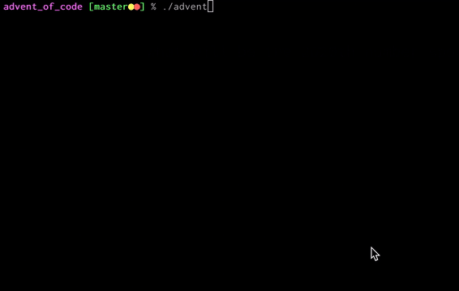

## Part 1

On first read, it seems like we'll want to track all of the numbers we say in a big list. That's not bad, but we're going to be doing a lot of lookups. That lends itself better to some sort of `dict`. We're going to be tracking data for each number, so let's use a `defaultdict(list)` so we can freely `.append` values. The key will be the number and the value will be a list of turns on which the number was said. Note that while the examples are 1-indexed (starting on turn 1), we're going to 0-index to write more natural Python code. The subtractions will be the same, so it's all good (that is, `turn 4 - turn 1` is the same as `3 - 0`).

Before we get to the meat of our loop, we need to ingest the input. For each, we store the number we speak and the turn (aka `index`) during which it was spoken.

```py
# custom input parsing
input_type = InputTypes.INTSPLIT
separator = ","
# ---

for index, value in enumerate(self.input):
    mem[value].append(index)
```

Next, we iterate over the rest of the input (up to the target value, `10` in the examples, `2020` in part 1) and check how many times we've seen it before. If it's been spoken once, we speak `0`. Otherwise, we speak the difference of the previous 2 times it's been spoken. Whatever gets spoken is the key, the value is our "turn".

```py
last_num = self.input[-1]

for turn in range(self.input, 2020):
    turns_spoken = mem[last_num]
    if len(turns_spoken) == 1:
        num_to_speak = 0
    else:
        num_to_speak = turns_spoken[-1] - turns_spoken[-2]

    mem[num_to_speak].append(turn)
    last_num = num_to_speak

return `last_num`
```

And that's actually it! A nice straightforward one.

## Part 2

Part 2 has the same prompt, just a _much_ longer `length`. Our part 1 completed just about instantly, but if we've got any performance issues, we're about to find them. Let's try it!

Bumping `2020` to `30_000_000` and... it's taking a while. I quit after ~ 10 seconds. It's weird though - all the operations we're performing are fast. Appending to an array, dictionary lookups, `len()`, and subtraction. All things that Python is great at. Let's add a `print` and see if progress is being made. Rather than doing so on every loop and overwhelming our terminal, we can print periodically and get a better sense of how progress is being made:

```py
for turn in range(len(self.input), length):
    if turn % 50000 == 0:
        print(turn)
    ...
```

Let's run it:



We're making pretty consistent progress! It's not an infinite loop or anything, it's just that 30M loops is a lot. It's interesting that printing certain numbers takes longer. That shows that we're not running in constant time. Something in our program gets slower the more loops it does. Let's profile it and check out what that might be.

Python supplies the [`cProfile` module](https://docs.python.org/3/library/profile.html), which allows us to benchmark our code. After importing, you use it by passing it a string to be `eval`ed:

```py
import cProfiler

def very_slow_function():
    ...

cProfile.run('very_slow_function()')
```

There are a number of ways to sort the results - I've found `tottime` to be most helpful. It pinpoints the individual functions that execution spends the most time in. I've got it [built into my `advent` command](https://github.com/xavdid/advent-of-code/blob/513f070cd043b898d5b745e248ab0dd466d689f0/advent#L89-L92), but you can drop it into your code pretty easily. Let's drop to 10M loops and remove our `print` statements (surprisingly slow) and see what we get:

```
% ./advent --profile

         20002654 function calls (20002596 primitive calls) in 14.600 seconds

   Ordered by: internal time

   ncalls  tottime  percall  cumtime  percall filename:lineno(function)
        1   11.276   11.276   13.836   13.836 solution.py:16(perform_series)
 10000059    1.356    0.000    1.356    0.000 {method 'append' of 'list' objects}
10000078/10000076    1.204    0.000    1.204    0.000 {built-in method builtins.len}
        1    0.752    0.752   14.588   14.588 solution.py:36(part_1)

    ... many more rows
```

A few things to note:

- profiling incurs a performance penalty. It's great for this, but if you want to know how long a solution takes to run, use `time SOME_COMMAND` instead
- obviously, our root function takes the longest, but we can skip that
- this output tells us `list.append` is, timing wise, the costliest thing we do, followed by `len()`

That's odd! Appending to a list is usually pretty fast. For our own edification, let's take a quick detour into why the single call to `.append()` is (eventually) the slowest line in the program.

Python, under the hood, is written in C. In C, when allocating (aka reserving) the memory for an `array`, you have to specify the exact length (and as a result, how much memory it needs). Python `list`s, however, don't share this requirement. So how does C know how much space to allocate for a new Python `list`? It turns out, it doesn't.

There's a C function which, given the length of a Python `list`, allocates an `array` long enough to hold it and some extra to grow into. You can add items into the Python `list` that will occupy the extra space. If/when you fill up the original C `array`, it creates a new, longer one and copies everything over. If you keep adding to your Python `list`, C carves out progressively larger `array`s and copying all the elements takes an increasingly long time.

I think that'll do for our detour. If you'd like to read more about Python's memory allocation in C, check out [this StackOverflow answer](https://stackoverflow.com/a/7247542/1825390).

Anyway.

After 30M loops, you can imagine that some of those `list`s are _huge_, especially the one for 0. We'll need to speed that up.

Skimming through the code, you'll notice that we only ever access the last 2 elements of the list, and we only care if the length is `1` or `any value besides one`. Given that, we probably don't need to store the whole list. In fact, we don't need to store a list at all. When storing a value for an element, we're interested in the difference between the last time we saw it and the current turn. So if we always store the current turn by default, future loops can store `turn - mem[last_numn]`. Now we're not storing any iterable at all, just a number. That also lets us use a simple `dict` instead of a `defaultdict`, since we're no longer appending to a list.

With these improvements, our code is simplified to:

```py
def calculate_sequence(self, loops):
    # 1-index the turns now so we start our loop with
    # the index on the last input element, not after it
    mem = {value: index + 1 for index, value in enumerate(self.input)}
    last_num = self.input[-1]

    for turn in range(len(self.input), loops):
        to_speak = turn - mem[last_num] if last_num in mem else 0
        mem[last_num] = turn
        last_num = to_speak

    return last_num
```

Boom! Down to `11.97s` (from `31.60s`).

---

From the Reddit comments, I learned that the pattern described in the prompt is known as the Van Eck sequence. Here's a [great YouTube video stepping through it](https://www.youtube.com/watch?v=etMJxB-igrc).
