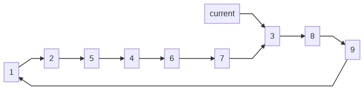
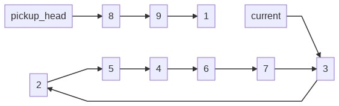
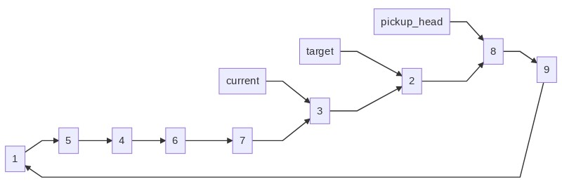

## Part 1

I started by trying to do a simple list and manage insertions and removals by slicing the array. Having to manage wrapping around the end of the list quickly got out of hand, so I had to go a different direction.

The puzzle doesn't care about the absolute position of the numbers in the list, just their order relative to each other. We can rotate the list freely as long as that's all we're doing. Doing that carefully will also make insertion much easier. A `deque` is perfect for this, since it handles rotation for us.

We'll start by parsing input and setting up our loop:

```py
cups = deque(map(int, self.input))
current_cup_value = cups[0]

for _ in range(100):
    ...
```

Now to fill in that `...`. Each step, we remove the 3 items after our `current`. So, let's put our `current` 4 from the end:

```py
assert current_cup_value in cups
while cups[-4] != current_cup_value:
    cups.rotate()
```

Note the `assert` statement. By validating in-code that our `while` loop will eventually exit, we protect ourselves from infinite loops.

Now we "pick up" cups by removing them from the list:

```py
to_insert = [cups.pop(), cups.pop(), cups.pop()]
to_insert.reverse()
```

Since Python statements are evaluated left-to-right, `to_insert` starts with the last item in the `deque`. Hence, we need to `reverse` our list so items retain their order. Next, finding the target and rotating the list:

```py
target_value = 9 if current_cup_value == 1 else current_cup_value - 1
while target_value in to_insert:
    target_value = 9 if target_value == 1 else target_value - 1

assert target_value in cups
while cups[-1] != target_value:
    cups.rotate()
cups.extend(to_insert)
```

The ternary statements there aren't the cleanest thing (and would need to be abstracted away if this was handling list lengths other than exactly 9), but it works. We've got another `assert`, after which our target is the last item in the list. Then we can re-add our removed cups.

Lastly, we need to reset our `current_cup_value`. This'll use the _very_ common pattern of `list[(something + 1) % len(list)]` for simulating a loop:

```py
current_cup_value = cups[(cups.index(current_cup_value) + 1) % 9]
```

Lastly, we rotate until `1` is at the front and join the rest as a string:

```py
assert 1 in cups
while cups[0] != 1:
    cups.rotate()

return "".join(map(str, cups))[1:]
```

## Part 2

This is a classic AoC move - part 1 can be solved by stepping through the puzzle instructions but part 2 uses way bigger numbers. A more technical approach is required. I couldn't come up with one off the top of my head, so let's adapt a Reddit solution, specifically [this one](https://old.reddit.com/r/adventofcode/comments/kimluc/2020_day_23_solutions/ggrtcop/).

Before, we stored a (very long) `deque` that we'd have to rotate many times per loop. Though that's a fast operation, we did it a lot. To store an ordered collection, Python introduces some overhead to track the order. As it turns out, we don't actually care which number is first in the list; just that the correct thing always comes next. There's a data structure that comes up in academia a lot that's perfect for this: the [linked list](https://en.wikipedia.org/wiki/Linked_list). A linked list consists of some number of `Node`s. Each has a value and a pointer to the `next` one. Traditionally, your program keeps a pointer to the start of the list so you don't lose track of it.

Linked lists in Python are great because variables are pointers to memory addresses. If variables `a` and `b` both point to the same value, and that value is updated, `a` and `b` will stay up to date:

```py
a = {'v': 1}
b = a
a['v'] = 2

>>> a
{'v': 2}

>>> b
{'v': 2}
```

That's because `b` points to the memory address that `a` points to. This can get you into trouble where functions can update variables when you don't expect them to, but it's great for us. We'll be able to update parts of our `Node` chain and have them all show current data.

Now for our code. We'll want to be able to quickly look up a given number, so we'll mostly work in a `dict`. The key will be the number and the value will be a little `Node` class:

```py
from dataclasses import dataclass

@dataclass
class Node:
    val: int
    # always defined, but not when the node is created
    next: "Node" = None
```

Our sequence is much larger than before (it's the input, plus every number from 10 to 1mil), but that's easy enough. Let's get a ton of `int`s and put them all in a big `list`:

```py
list_size = 1_000_000
num_loops = 10_000_000

sequence: List[int] = [*map(int, self.input), *range(10, list_size + 1)]
cups: Dict[int, Node] = {}
assert list_size == len(sequence)

for i in sequence:
    cups[i] = Node(i)
```

Now we can quickly find the `Node` for any number. But we lack any pointers. Let's fix that. For each item in the sequence, we lookup that `Node` and set its `next` equal to the `Node` for the next value in the sequence:

```py
for index, value in enumerate(sequence):
    cups[value].next = cups[sequence[(index + 1) % list_size]]
```

Now we're ready to solve! The actual algorithm looks a lot like the one from part 1. Truth be told, we could do part 1 with the part 2 code we're about to write. Anyway, let's step through it.

We start with the `current` cup, which points to the head of the array:



```py
for _ in range(num_loops):
    current = cups[sequence[0]]
```

Now we loop. In each loop, we make a pointer to the first item after the current (`current.next`). Then we update `current.next` to point to the 4th item in the chain (where it will point once the next 3 items are removed):



```py
    ...
    pickup_head = current.next
    # "remove" 3 elements
    current.next = current.next.next.next.next
```

This is where our `Node` class shines. We could have a dict where the value is the keys "next", but then the bottom line above would be `cups[current] = cups[cups[cups[cups[current]]]]`, which is worse.

Next, we find the target cup, which is `current - 1` (a process we repeat while that value is a cup we just picked up):

```py
    ...
    val = current.val
    while val in [
        current.val,
        pickup_head.val,
        pickup_head.next.val,
        pickup_head.next.next.val,
    ]:
        val = list_size if val == 1 else val - 1
```

Now we do the swap:



```py
    ...
    target = cups[val]
    pickup_head.next.next.next = target.next
    target.next = pickup_head
```

If you follow each line of the code below the images, you should see each new arrow that's created. If we keep that up, we can reposition items in the loop quickly and efficiently. We do that a bunch of times and once the loop's done, we return the answer:

```py
cups[1].next.val * cups[1].next.next.val
```
