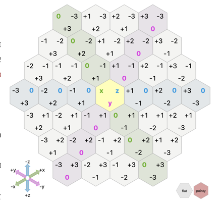

## Part 1

The only real curveball today is the hex grid. Though we [know it to be the best shape](https://www.youtube.com/watch?v=thOifuHs6eY), a lot of folks (myself included) don't have a lot of experience working with them programmatically. If today's puzzle used a standard Cartesian grid, it would be a walk in the park. Luckily, hexes aren't too different.

Like I mentioned, this was my first time using hexes in a program. We can define the points however we want as long as we're consistent about it. I turned to an expert on the subject, Amit Patel, and his blog, Red Blob Games. It's a great resource for algorithms in videogames (and a great place to learn, even if you're not writing a game). He's written the veritable bible on hex grids. The whole thing is great, but [this is the pertinent bit](https://www.redblobgames.com/grids/hexagons/#coordinates-cube). He describes a system where each point is expressed as `(x, y, z)` and for any point, `x + y + z == 0`. He's included a helpful diagram:



You can click through to his site, as the diagram itself is interactive. It's a great way to visualize the grid we're about to write.

If our start point is `(0, 0, 0)`, we can assign offsets for each of the 6 directions pictured above (and used in our propt). Immediately to the left (`W`) of the start is `(-1, 1, 0)`, `NW` is `(0, 1, -1)`, and so forth. Whenever we parse that string out of input, we want to get offset in that direction:

```py
offsets = {
    "e": (1, -1, 0),
    "w": (-1, 1, 0),
    "se": (0, -1, 1),
    "nw": (0, 1, -1),
    "ne": (1, 0, -1),
    "sw": (-1, 0, 1),
}
```

Grokking that concept is honestly the lion's share of the work in part 1; the rest of the code is straightforward.

First, We read the next instruction based on its width:

```py
from typing import Set, Tuple

black_tiles: Set[Tuple[int, int, int]] = set()

for line in self.input:
    tile = (0, 0, 0)
    i = 0
    while i < len(line):
        if line[i] in ["w", "e"]:
            width = 1
        else:
            width = 2
```

Then we use `zip` to combine our current `tile` with the offset, which can be written very concisely:

```py
    ...
    tile = tuple(map(sum, zip(tile, offsets[line[i : i + width]])))

    # or
    offset = offsets[line[i : i + width]]
    tile = tuple(a + b for a, b in zip(tile, offset))

    i += width
```

Once the `while` loop is done, we check if that tile is in `black_tiles`. If it is, we remove it; otherwise add it. Our final answer is the number of black tiles:

```py
for line in self.input:
    ...
    if tile in black_tiles:
        black_tiles.remove(tile)
    else:
        black_tiles.add(tile)

return len(black_tiles)
```

## Part 2

Hopefully this sounds familiar- it's another take on Conway's Game of Life. So similar, in fact, that we can take the same approach as we did in [day 17](https://github.com/xavdid/advent-of-code/blob/main/solutions/2020/day_17/README.md#part-2). On each loop, we'll build a `Counter` with each neighbor of each black tile:

```py
from collections import Counter

Point = Tuple[int, int, int]

def calculate_offset(tile: Point, offset: Point) -> Point:
    return tuple(map(sum, zip(tile, offset)))

def neighbors(tile: Point) -> List[Point]:
    return [calculate_offset(tile, o) for o in offsets.values()]

# part 1 code, builds the first set of `black_tiles`
...

for _ in range(100):
    c = Counter()
    for t in black_tiles:
        c.update(neighbors(t))
```

Now we start a new `set` and walk through the counter to apply the rules from the prompt:

```py
for _ in range(100):
    ...

    tomorrows_tiles = set()
    for tile, count in c.items():
        if tile in black_tiles and (count == 0 or count > 2):
            # isn't stored as black
            continue

        if tile not in black_tiles and count == 2:
            tomorrows_tiles.add(tile)
            continue

        if tile in black_tiles:
            # the rest of the black tiles stay black
            tomorrows_tiles.add(tile)

    black_tiles = tomorrows_tiles
```

Once we've done that loop, `len(black_tiles)` again has our answer.
