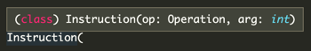

## Part 1

I get the sense that we'll be seeing a lot more of this game console in the coming days, so it'll pay off to be extra organized.

Let's start with a simple `enum` to hold the different operations:

```py
class Operation(Enum):
    NOP = "nop"
    ACC = "acc"
    JMP = "jmp"
```

And a simple `dataclass` to hold our instructions:

```py
from dataclasses import dataclass

@dataclass
class Instruction:
    op: Operation
    # signed int
    arg: int
```

Remember - `dataclass`es are a simple version of a Python `class` that specialize in holding data. You can add methods just like a normal class, but a nice `__init__` method is created for you:



We're also worried about infinite loops, so let's add a custom `Exception` we can catch:

```py
class InfiniteLoopException(Exception):
    pass
```

That's some grade-A groundwork! Our little [VM](https://en.wikipedia.org/wiki/Virtual_machine) (a computer that exists entirely in software) has a pointer, accumulator, and a list of instructions:

```py
class VM:
    pointer: int = 0
    acc: int = 0
    instructions: List[Instruction]
```

We'll get instructions (our parsed puzzle input) and store `Instruction` objects:

```py
def __init__(self, instructions: List[str]) -> None:
    self.visited = set()
    self.instructions = []

    for i in instructions:
        op, arg = i.split(" ")
        self.instructions.append(Instruction(Operation(op), int(arg)))
```

The puzzle is about making sure we don't execute the same instruction twice, so we'll keep a set of the pointer indexes that we've already seen.

To execute an instruction, we modify state based on the operation type:

```py
def execute(self):
    ins = self.instructions[self.pointer]
    if self.pointer in self.visited:
        raise InfiniteLoopException()

    self.visited.add(self.pointer)

    if ins.op == Operation.NOP:
        self.pointer += 1

    elif ins.op == Operation.ACC:
        self.acc += ins.arg
        self.pointer += 1

    elif ins.op == Operation.JMP:
        self.pointer += ins.arg

    else:
        raise ValueError(f"unknown operator: {ins.op}")
```

Hopefully there's nothing too surprising here. All that's left to do is keep executing until our `InfiniteLoopException` is raised:

```py
def run(self):
while True:
    self.execute()
```

Which leaves our actual puzzle solution:

```py
vm = VM(self.input)
try:
    vm.run()
except InfiniteLoopException:
    return vm.acc
```

`vm.run()` will exit on error, which for now, we know is coming at some point.

## Part 2

There's probably a clever way to do this part, but I opted for a brute force approach instead.

We're going to loop through each item in the input and swap any `jmp` / `nop` instructions one at a time. Then we run the VM and see if the error is thrown. If not, we've found the instruction we need to fix!

To set this up, we need to add a single line in `run`:

```py
def run(self) -> None:
while True:
    self.execute()
    # now we can terminate without an error
    if self.pointer >= len(self.instructions):
        break
```

Our puzzle code is straightforward:

```py
for i in range(len(self.input)):
    if self.input[i].startswith("acc"):
        continue

    vm = VM(self.input)
    # swap the operation w/ a ternary
    vm.instructions[i].op = (
        Operation.NOP
        if vm.instructions[i].op == Operation.JMP
        else Operation.JMP
    )

    try:
        vm.run()
    except InfiniteLoopException:
        continue

    # if we got here, the program terminated successfully
    return vm.acc
```

The only slightly tricky thing is the Python ternary: `a if X else b`. To be honest, I find the JS version much more readable (`X ? a : b`), but Python's is functional nonetheless.
