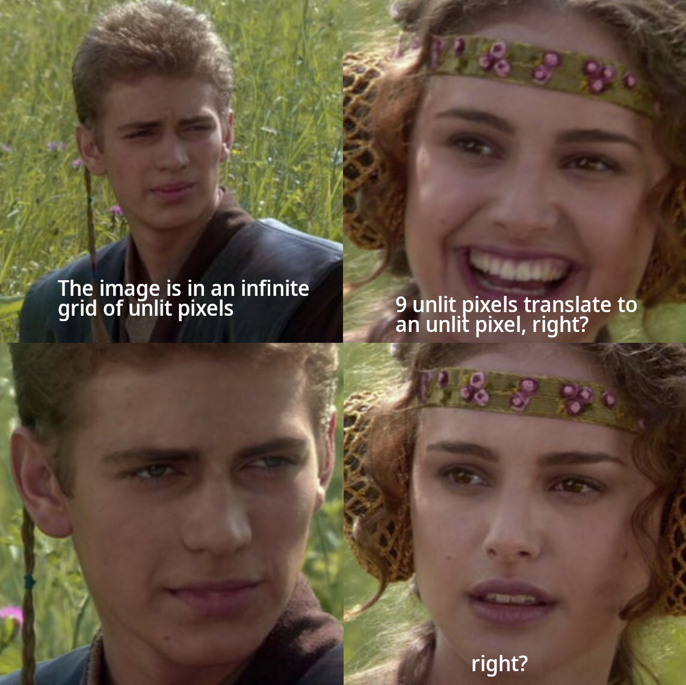

## Part 1

I was so confident. I read this prompt through and felt right away like I knew how to do it. All I needed was a `set` to store the points where were illuminated. On each [enhancement](https://www.youtube.com/watch?v=3uoM5kfZIQ0), I could iterate the list of illuminated pixels and calculate their new value. I'd also need to calculate any for any pixel that _neighbored_ an illuminated pixel. If your 3x3 grid has no `#`, then you can't turn on, so it can be safely ignored. Coded it up, passed the sample input and... failed my puzzle input. That's unusual. I stepped through the sample and it did exactly what it was supposed to. Out of frustration, I took to reddit and searched recent posts with `day 20`, hoping for a hint (can usually find people asking for help rather than going straight to the solutions thread). I came across [this post](https://old.reddit.com/r/adventofcode/comments/rkpdlv/2021_day_20_me_right_now_reading_the_problem/), which made me laugh and cry at the same time:



In the sample, the enhancement algorithm started with a `.`, meaning 9 dots (out in infinite space somewhere) would always stay a `0`. But, in my (and it turns out, everyone's) puzzle input, the string started with `#`. As a result, the infinite field turns on every other step. Luckily, the puzzle is asking about an odd step, so the field will be dark. But, that means pixels that border the infinite have to account for unknown pixels sometimes being `#` instead of always being `.`. Well played, puzzle creator.

Once I got the trick, the rest wasn't too bad. We have to look at every pixel in the input (or that neighbors anything in the input) and calculate its value on each step. We can use a dict of `point -> bool` to reduce the amount of data we have to store (since there'll be a lot of it). We'll also need a variable to track what the current default for the infinite space is (it alternates, but only if the enhancement string starts with a `#`. Let's code that up:

```py
from typing import Tuple

# set of indexes that will result in an illuminated pixel
enhancer = {x for x in range(len(self.input[0])) if self.input[0][x] == "#"}
# the bounds are initialized as `.`, regardless of if we swap
if_missing = False
# don't really need this for the puzzle solution, but it allows the code to work
# for both the sample and the puzzle
should_swap = self.input[0][0] == "#"

GridPoint = Tuple[int, int]
Image = Dict[GridPoint, bool]

# read input
image: Image = {}
for y, line in enumerate(self.input[2:]):
    for x, c in enumerate(line):
        image[(x, y)] = c == "#"
```

Next is the pixel iteration. Because I'm using it so much, I finally wrote a `neighbors` function into my base class:

```py
from operator import itemgetter

# in my custom base file
GridPoint = Tuple[int, int]
# sort the direction tuples so they go from top left to bottom right
DIRECTIONS = sorted(product((-1, 0, 1), repeat=2), key=itemgetter(1))
```

`operator` (a package we saw before on [day 16](/writeups/2021/day/16/)) supplies a function that returns a function. `itemgetter(N)` creates a function that returns `item[N]` for anything you pass it. It's roughly you could write this as:

```py
def itemgetter(N: int):
    def inner(obj):
        return obj[N]
    return inner

l = ['a', 'b', 'c']
get_1 = itemgetter(1)
print(get_1(l)) # => 'b'
```

This lets us sort our list of tuples by their second element (instead of by their first, the default). We could have also used `lambda x: x[1]` as the `key`, but `itemgetter` is more of a standard and handles more complex cases, so it's good to be familiar with it.

Past that, we loop through that list and `yield` relevant neighbors like we've done before. The function includes some helpful parameters for handling different types of grid (such as those that don't go negative) and will likely evolve further over time:

```py
# also in my base file
def neighbors(
    center: GridPoint,
    num_directions=8,
    *,
    ignore_negatives: bool = False,
    max_size: int = 0,
) -> Iterator[Tuple[int, int]]:
    """
    given a point (2-tuple) it yields each neighboring point. Iterates from top left to bottom right, skipping any points as described below:

    * `num_directions`: Can get cardinal directions (4), include diagonals (8), or include self (9)
    * `ignore_negatives`: skips points where either value is less than 0
    * `max_size`: skips points where either value is greater than the max grid size. Currently assumes a square grid
    """
    assert num_directions in [4, 8, 9]

    for dx, dy in DIRECTIONS:
        if num_directions == 4 and dx and dy:
            # diagonal; skip
            continue

        if num_directions == 8 and not (dx or dy):
            # skip self
            continue

        rx = center[0] + dx
        ry = center[1] + dy

        if ignore_negatives and (rx < 0 or ry < 0):
            continue

        if max_size and (rx > max_size or ry > max_size):
            continue

        yield (rx, ry)

```

Finally, we can do our actual enhancement like I described above:

```py
# initial input is stored in `image`

for _ in range(2):
    new_image: Image = {}
    for pixel in image:
        for neighbor in neighbors(pixel, 9):
            # this line brings a 5x speed increase
            if neighbor in new_image:
                continue
            # get each digit
            result = [
                # if_missing is the current state of the "infinite" part of the grid
                "1" if image.get(n, if_missing) else "0"
                for n in neighbors(neighbor, 9)
            ]
            # merge them as parse as binary; check if it's in our `Set[int]`
            # each neighbor is stored, so store points grows slowly over time
            new_image[neighbor] = int("".join(result), 2) in enhancer

    image = new_image
    # again, this is just so the code works for both the sample and the puzzle
    if should_swap:
        if_missing = not if_missing

return len([x for x in image.values() if x])
```

That should all be fairly familiar. We count it up at the end and are all set!

## Part 2

AoC speed check! Can you do part 1, but many more times? Luckily, the answer is yes!

```py
# input parsing, etc
...

results = []
for i in range(50):
    # same code
    ...

    if i in [1, 49]:
        results.append(len([x for x in image.values() if x]))

return results
```

I know I keep saying "this is my slowest day yet", but this time it's really is. Everything so far has been under 1 second for both parts; today is north of 4.5s. The profiler points to calling `neighbors` a _bunch_. Some things just take time.
