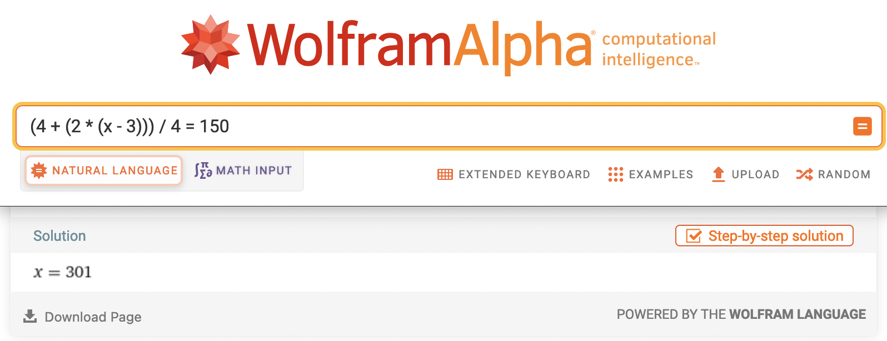

## Part 1

Today might look like a good candidate for recursion (or dynamic programming), but I found it simpler to just loop until our exit condition is met.

We'll sort our monkeys into two groups: `settled` and `tbd`. The settled monkeys are those who have said (or calculated) their number, while the TBD monkeys are still equations. We'll loop over TBD, moving monkeys to settled as applicable. Easy enough, right? Let's parse some input:

```py
class Solution(StrSplitSolution):
    def part_1(self) -> int:
        settled: dict[str, int] = {}
        tbd: dict[str, str] = {}

        for line in self.input:
            name, value = line.split(": ")
            if value.isdigit():
                settled[name] = int(value)
            else:
                tbd[name] = value
```

There's our two dicts. Next, we loop:

```py
class Solution(StrSplitSolution):
    def part_1(self) -> int:
        ...

        while "root" not in settled:
            # TODO

        return settled["root"]
```

Finally, we need to settle our monkeys, if we can. We can only do that if each of the named monkeys is already in `settled`. If so, we can run the calculation; if not, we'll circle back later:

```py
from operator import add, sub, mul, truediv

OPERATIONS = {"+": add, "-": sub, "*": mul, "/": truediv}

class Solution(StrSplitSolution):
    def part_1(self) -> int:
        ...

        while "root" not in settled:
            for name, eq in list(tbd.items()):
                l, op, r = eq.split()
                if l in settled and r in settled:
                    settled[name] = OPERATIONS[op](int(settled[l]), int(settled[r]))
                    tbd.pop(name)
```

Nothing too surprising here - we have a little lookup dictionary that wraps `operator` functions (similar to our approach in [day 11](https://github.com/xavdid/advent-of-code/blob/main/solutions/2022/day_11/README.md)). The only really notable thing is that we wrap our `.items()` call in `list` so that we can freely modify `tbd` while we're iterating over it. This approach _can_ be a source of bugs (since you're iterating over stale data), but it's convenient for us because we don't have to worry about our iteration order.

I was worried this would result in too many loops, but I got an answer from my puzzle input after 44 iterations; not bad at all.

## Part 2

I found part 2 a super interesting spin on the puzzle. When it boils down to it, we need to write an equation solver. It's honestly not even complicated on paper - on one side we'll have a number and on the other, a series of math operations involving some unknown number, `x`.

Spoiler, my approach didn't work, but it's still an interesting exploration. If you're just here for The Good Stuff, feel free to [jump ahead](#the-working-way).

### The Wrong Way

Seemed easy enough, I thought to myself. After looking through the sample input, I noticed that each name (besides `root`) appeared exactly 2 times - once as a key and once in an equation; no repeats at all. This meant the two halves of root (`pppw` and `sjmn` in the example) were built from two totally separate trees. A bit of tree walking confirmed this:

```py
...

class Solution(StrSplitSolution):
    ...

    def part_2(self) -> int:
        # the input parsing from part 2
        settled, tbd = self.parse_input()

        def build_tree(name: str, group: set[str]):
            group.add(name)

            if name in settled:
                return

            l, _, r = tbd[name].split()

            build_tree(l, group)
            build_tree(r, group)

        left_leader, _, right_leader = tbd["root"].split()

        left: set[str] = set()
        build_tree(left_leader, left)

        right: set[str] = set()
        build_tree(right_leader, right)

        # no overlap
        assert not left & right
        # in my input (and the example), `humn` was in left
        # the subsequent code will be reversed if yours is different
        assert "humn" in left
```

Without overlap, I could fully resolve `right` so I'd know what value `left` would have to equal. Then, I could iterate through possible values of `humn` until I had a match! I wrote a block that would resolve a set of keys (instead of the whole `tbd` dict):

```py
...

class Solution(StrSplitSolution):
    ...

    def part_2(self) -> int:
        ...

        while right:
            for name in list(right):
                if name not in tbd:
                    right.remove(name)
                    continue

                eq = tbd[name]
                l, op, r = eq.split()
                if l in settled and r in settled:
                    settled[name] = OPERATIONS[op](settled[l], settled[r])
                    tbd.pop(name)
                    right.remove(name)

        goal = settled[right_leader]
```

And, out popped an `int`! Before continuing, I'll do a bit of pre-optimization, I [foolishly](https://softwareengineering.stackexchange.com/a/80092) thought. Instead of starting from scratch on the left on each iteration, I'll resolve everything that doesn't involve `humn`. This is largely the same as the above, but I had a boolean that tracked when I looped without making any changes (and then bailed).

Full of overconfidence, I reused my original code [^2] and stuck it in a loop:

```py
...

class Solution(StrSplitSolution):
    ...

    def part_2(self) -> int:
        ...

        for i in range(1_000):
            settled["humn"] = i

            attempt_settled = settled.copy()
            attempt_tbd = tbd.copy()

            while left_leader not in attempt_settled:
                ... # previous code

            if attempt_settled[left_leader] == goal:
                return i

        raise ValueError('no solution found')
```

I looked at the input and most numbers were less than 50. I figured 1,000 would be _plenty_ of headroom. I ran it on the sample input and... success! Now let's do the actual puzzle and... error. Ok, bump it up to 10k... nope. 100k? 1 million? Still, no dice. I'd clearly need a different approach, but I was out of (practical) ideas.

### The Working Way

After sadly watching my laptop work through every number under 1 million [^1], I needed a different approach.

Ultimately, we're solving an equation. Unfortunately, because of the way we solved part 1, it's not convenient to build that equation. It's not terribly hard (just a bit of recursion), but we'd still have to solve that equation.

Just for kicks, I solved the sample input by hand, replacing the variables as I went. That left me with:

```
(4 + (2 * (humn - 3))) / 4 == 150
```

Plug that into Wolfram Alpha, and we get 301, our sample answer:



But, I don't didn't know how to tell Python to solve an equation like that.[^3]

After spinning my wheels a bit, I made for the daily [solution thread](https://old.reddit.com/r/adventofcode/comments/zrav4h/2022_day_21_solutions/) for inspiration. I came across [this absolute gem](https://old.reddit.com/r/adventofcode/comments/zrav4h/2022_day_21_solutions/j133ko6/) of a solution by `/u/Anton31Kah`. It uses "imaginary numbers", a concept I hadn't thought about since high school. A quick refresher: imaginary numbers, traditionally represented by `i`, can never be resolved. Instead, the answer of an equation involving `i` is expressed in _terms_ of `i`. While `2 * 2` can be simplified to `4`, `2 * i` cannot be further broken down.

Miraculously, this is something that Python supports natively in the new-to-me `complex` type. Imaginary numbers are written with a trialing `j`. Check this out:

```py
>>> 1 + 1
2

>>> 1 + 1j
(1+1j)

>>> 1 + 1j + 1
(2+1j)

>>> 1 + 1j + 1 + 1j
(2+2j)
```

Python keeps the imaginary portion of the equation wholly separate from the real and does the appropriate math on each. Sounds useful, right?

If we replace the value of `humn` with `1j`, we can largely repeat part 1 and see what we end up with. I've done some refactoring, but the code is the same:

```py
...

class Solution(StrSplitSolution):
    def _solve(self, settled: dict, tbd: dict):
        while "root" not in settled:
            ... # part 1 loop
    ...

    def part_2(self) -> int:
        settled, tbd = self.parse_input()

        settled["humn"] = 1j
        l, _, r = tbd["root"].split()

        self._solve(settled, tbd)

        # temp
        print(f"{settled[l]} == {settled[r]}")
```

Running that on the sample gives us the following equation:

```py
(-0.5+0.5j) == 150
```

If we treat `j` as a variable, Wolfram once again confirms `301` as the answer. But we can't keep plugging data into Wolfram- we have to actually spit out an answer. Luckily, we can easily separate out the real and imaginary portions of a number. After that, solving the equation itself is blessedly simple; just some subtraction and division. Let's wrap it up:

```py
...

class Solution(StrSplitSolution):
    ...

    def part_2(self) -> int:
        ...

        self._solve(settled, tbd)
        eq, goal = settled[l], settled[r]

        return round((goal - eq.real) / eq.imag)
```

And that, as they say, is that!

[^1]: which, scientists claim, is nearly a million individual numbers!
[^2]: I'll be honest, all of my initial work here used no functions at all; just the same block, haphazardly duplicated repeatedly. Not my finest hour.
[^3]: Without an [external library](https://problemsolvingwithpython.com/10-Symbolic-Math/10.06-Solving-Equations/#equations-with-one-solution), anyway.
