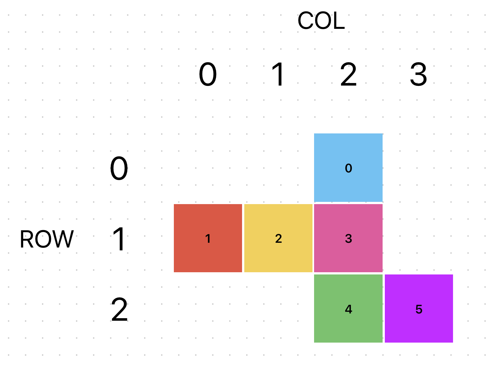
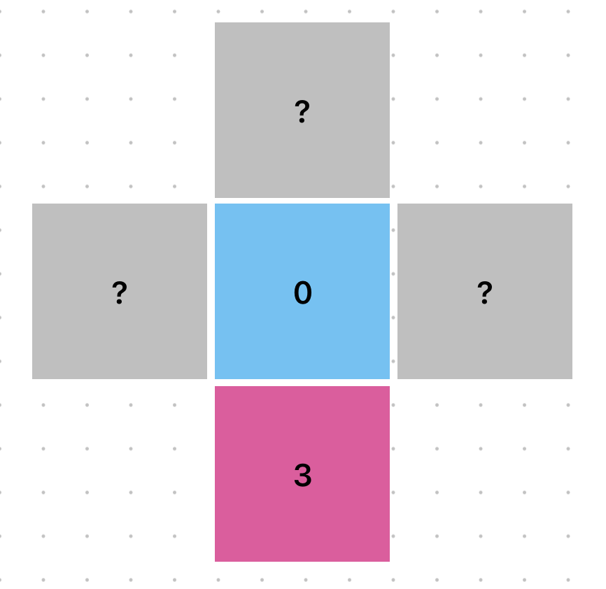
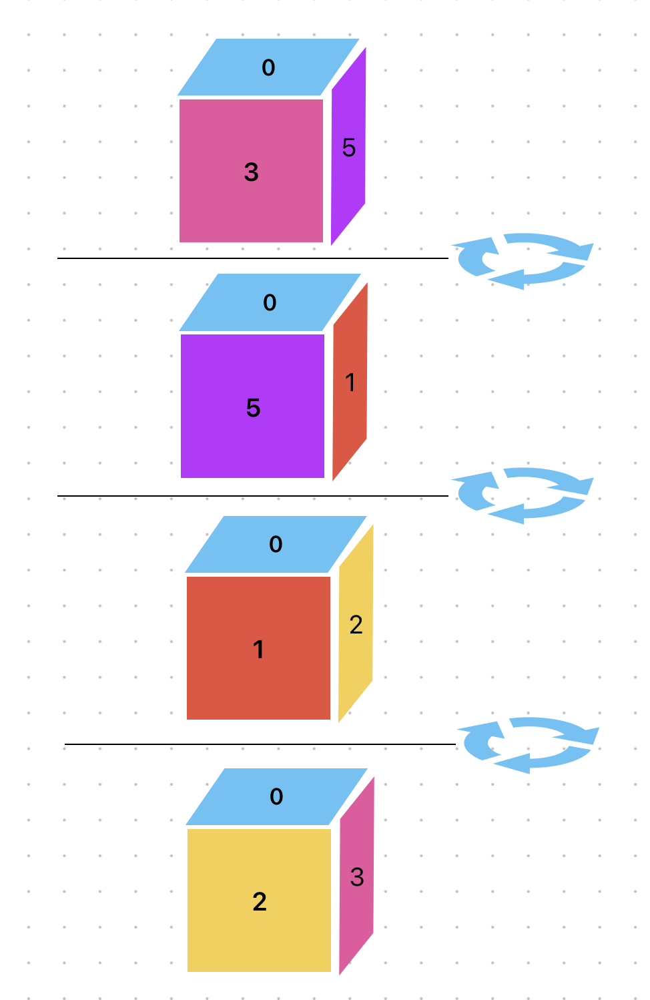
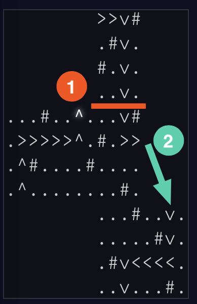

## Part 1

The odd-shaped grid caught me by surprise to start, but it didn't end up being too bad.

We can treat our grid as a big rectangle that circumscribes the actual points. Using our same `(row,col)` grid from before, we can lay this weird shape out more normally:

```
   000000000011111111
   012345678901234556
00         ...#
01         .#..
02         #...
03         ....
04 ...#.......#
05 ........#...
06 ..#....#....
07 ..........#.
08         ...#....
09         .....#..
10         .#......
11         ......#.
```

We'll use a `dict` that maps grid points to a boolean. If a point isn't in the `dict`, it's a blank space and we'll skip over it when moving (more on that soon). Otherwise, we can use a `bool` to represent whether we can walk on a given space.

Let's put this in a class:

```py
GridPoint = tuple[int, int]

class SparseGrid:
    def parse_grid(self, raw_grid: str) -> tuple[dict[GridPoint, bool], int, int]:
        rows = raw_grid.split("\n")
        max_rows = len(rows)
        max_cols = max(len(s) for s in rows)

        grid: dict[GridPoint, bool] = {}

        for row, line in enumerate(rows):
            for col, c in enumerate(line):
                if c == " ":
                    continue
                grid[(row, col)] = c == "."

        return grid, max_rows, max_cols
```

This handles the top half of the input, but we also need to parse the path, which is numbers and letters:

```py
class SparseGrid:
    ...

    def parse_path(self, s: str) -> list[Literal["L", "R"] | int]:
        return [int(c) if c.isdigit() else c for c in re.findall(r"\d+|\w", s)]
```

Regex to the rescue! It finds digits and letters without us having to worry about long numbers.

Wrap that all in an `__init__` method and we're off to the races:

```py
class SparseGrid:
    def __init__(self, raw_input: str) -> None:
        grid, path = raw_input.split("\n\n")

        self.grid, self.max_rows, self.max_cols = self.parse_grid(grid)
        self.path = self.parse_path(path)
    ...
```

There's two important pieces of state we need to maintain: our current location and our direction. We'll make like we did on [day 17](/writeups/2022/day/17/) and add an offset to our location based on the direction we're facing. Rotating is a matter of wrapping an index around a list (using the modulo operator). Our starting location is the first `.` on the top row, so we can add that to `__init__`:

```py
OFFSETS = [(0, 1), (1, 0), (0, -1), (-1, 0)]

class SparseGrid:
    offset_index = 0

    def __init__(self, raw_input: str) -> None:
        ...

        self.location: GridPoint = 0, raw_input.find(".")

    def rotate(self, direction: Literal["L", "R"]):
        x = -1 if direction == "L" else 1
        self.offset_index = (self.offset_index + x) % 4

    @property
    def offset(self):
        return OFFSETS[self.offset_index]
```

Finally, we're ready to actually process instructions. We've done a good job making our functions small and descriptive, so the actual work is pretty straightforward here:

```py
class SparseGrid:
    ...

    def run(self):
        for instruction in self.path:
            if isinstance(instruction, str):
                self.rotate(instruction)
            else:
                for _ in range(instruction):
                    ... # TODO

        return (
            # add 1 because our grid is 0-indexed
            1000 * (self.location[0] + 1)
            + 4 * (self.location[1] + 1)
            + self.offset_index
        )
```

All that remains is moving a specified number of times (if able). That last part is really the rub, specifically finding the next valid step. Luckily, we've made a distinction between points we can't step on (`False`) and points that don't exist at all (missing from the `dict`). We have to write a function to wrap around if we've left the grid entirely, but otherwise that'll do a lot of the heavy listing for us. It's not so bad:

```py
...

def add(loc: GridPoint, offset: GridPoint) -> GridPoint:
    return loc[0] + offset[0], loc[1] + offset[1]

class SparseGrid:
    ...

    def next_valid_loc(self) -> GridPoint:
        next_loc = add(self.location, self.offset)

        while next_loc not in self.grid:
            if next_loc[0] >= self.max_rows:
                next_loc = -1, next_loc[1]
            elif next_loc[1] >= self.max_cols:
                next_loc = next_loc[0], -1
            elif next_loc[0] < 0:
                next_loc = self.max_rows, next_loc[1]
            elif next_loc[1] < 0:
                next_loc = next_loc[0], self.max_cols

            next_loc = add(next_loc, self.offset)

        return next_loc
```

`next_valid_loc` walks in a set direction until it finds a point that's in the grid. It doesn't much care what the point is, just that we're back on the map.

This lets us fill in the rest of our `run` code:

```py
class SparseGrid:
    ...

    def run(self):
        for instruction in self.path:
            if isinstance(instruction, str):
                self.rotate(instruction)
            else:
                for _ in range(instruction):
                    # update location if the next in-grid location isn't a wall
                    # the walrus works even inside a dict lookup!
                    if self.grid[next_loc := self.next_valid_loc()]:
                        self.location = next_loc
                    else:
                        break

        return ...
```

Instantiating and running our `SparseGrid` is all that remains:

```py
class Solution(TextSolution):
    def part_1(self) -> int:
        return SparseGrid(self.input).run()
```

## Part 2

Part 2 is generically the same as part 1, but there's a _big_ shift in our parsing and "next valid location" logic. But, working in 3D isn't something I have much experience with.

After spinning my wheels for a while, I turned to [the solution thread](https://xavd.id/aoc/2022/22) for assistance. I liked [this solution](https://old.reddit.com/r/adventofcode/comments/zsct8w/2022_day_22_solutions/j184mn7/) by `/u/smrq` the best, since it works for any valid input (always my goal with AoC). Now that I've taken the time to translate it from JS, understand it, and refactor it, I'm excited to share these efforts with you. Remember- the main goal of AoC is to learn! Don't fret if you can't solve them all yourself (I certainly don't).

Let's start by making a shared base class that our part 1 code uses:

```py
class BaseGrid:
    offset_index = 0

    def __init__(self, raw_input: str) -> None:
        raw_grid, path = raw_input.split("\n\n")

        self.location = 0, 0
        self.path = parse_path(path)
        self._post_init(raw_grid)

    def _post_init(self, raw_grid: str):
        """
        expected to do any setup and instance variable assignments
        """
        raise NotImplementedError()

    @property
    def offset(self) -> GridPoint:
        return OFFSETS[self.offset_index]

    def rotate(self, direction: Literal["L", "R"]):
        x = -1 if direction == "L" else 1
        self.offset_index = (self.offset_index + x) % 4
```

and we tweak `SparseGrid` to use it. We'll put solution-specific setup in the `_post_init` method, which the root's `__init__` will call:

```py
...

class SparseGrid(BaseGrid):
    def _post_init(self, raw_grid: str):
        self.grid, self.max_rows, self.max_cols = self.parse_grid(raw_grid)
        self.location: GridPoint = 0, raw_grid.find(".")
```

The rest of part 1 is the same, so we're ready for part 2!

The actual puzzle involves walking around a 2D map, so we have to store information about the original grid. But, we also can't just wrap around between map sections like we were doing before, since we don't know where we'll end up or which direction we'll be facing. Instead, we'll have to know which regions of the 2D map correspond to faces on the cube and model walking around its edges. Besides lots of new parsing code, this will also involve a new `next_valid_loc`. Let's break it down!

First, we'll re-parse the top section of our input. Instead of treating it like one big grid, we want to "zoom out" and outline our flat cube faces. We start by calculating the size of each face. In the example input, cube faces are 4x4. Because we know the input is well formed, we know the number of grid points (the count of `.` and `#`) must be a multiple of 6. After the division, we have the number of grid points on a single face, the square root of which is our cube face size:

```py
...

class CubeGrid(BaseGrid):
    cube_face_size: int

    def _post_init(self, raw_grid: str):
        self.cube_face_size = int(sqrt((raw_grid.count(".") + raw_grid.count("#")) / 6))
```

The sample cube has `96` grid points. Divide that by `6` and you have a single face build from `16` points. Square root that and you know that each side of the cube is built from 4x4 faces.

Now the faces themselves. Rather than looping across every point in the grid, we only care about points that could be the top-left corner of a cube face. To iterate, we look at the max size of the grid and divide that by the `cube_face_size`. Our sample input shrinks from `12` points tall and `16` points wide down to a 3x4 grid where each of the 12 spots can hold an un-folded cube face. _That's_ what we'll be iterating over:

```py
...

class CubeGrid(BaseGrid):
    ...

    def parse_cube(self, raw_grid: str):
        grid = raw_grid.split("\n")

        longest_line_length = max(len(l) for l in grid) // self.cube_face_size

        for row in range(len(grid) // self.cube_face_size):
            for col in range(longest_line_length):
                try:
                    c = grid[row * self.cube_face_size][col * self.cube_face_size]
                except IndexError:
                    # TODO
```

As we loop, we'll only land on the following points in our sample input (marked with an `X`):

```
X   X   X111
        1111
        1111
        1111
X222X333X444
222233334444
222233334444
222233334444
X   X   X555X666
        55556666
        55556666
        55556666
```

Note that because most editors trim trailing whitespace, the string representing the left-aligned lines are shorter than the right-alined ones. That's why we have to handle the `IndexError` and are iterating columns based on the longest lines in the grid.

You can see by the way we're looping in the sample input that we'll correctly find each of our eventual cube faces. But what do we do with them? For now, we'll grab the subgrid (the `16` values on that face) and store them in a class, along with that face's location in our 2D map. We'll store those classes in a list and put the index of each face in a 2D `dict` so we can find it later:

```py
from dataclasses import dataclass

@dataclass
class CubeFace:
    # (row, col) in the 2D map
    map_loc: tuple[int, int]
    # values from the original grid belonging to this cube face
    subgrid: list[list[str]]

...

FlatCube = dict[int, dict[int, int | None]]

class CubeGrid(BaseGrid):
    ...

    faces: list[CubeFace]
    flat_cube: FlatCube

    def _post_init(self, raw_grid: str):
        ...

        self.faces, self.flat_cube = self.parse_cube(raw_grid)

    def parse_cube(self, raw_grid: str) -> tuple[list[CubeFace], FlatCube]:
        grid = raw_grid.split("\n")

        longest_line_length = max(len(l) for l in grid) // self.cube_face_size

        faces: list[CubeFace] = []
        flat_cube: FlatCube = {}

        for row in range(len(grid) // self.cube_face_size):
            flat_cube[row] = {}
            for col in range(longest_line_length):
                try:
                    c = grid[row * self.cube_face_size][col * self.cube_face_size]
                except IndexError:
                    flat_cube[row][col] = None
                else:
                    if c == " ":
                        flat_cube[row][col] = None
                        continue

                    subgrid = [
                        list(
                            line[
                                col
                                * self.cube_face_size : (col + 1)
                                * self.cube_face_size
                            ]
                        )
                        for line in grid[
                            row * self.cube_face_size : (row + 1) * self.cube_face_size
                        ]
                    ]

                    flat_cube[row][col] = len(faces)
                    faces.append(CubeFace((row, col), subgrid))

        return faces, flat_cube
```

It looks like a lot, but that's our full grid parser! There's a nested comprehension for the subgrid and some odd-looking indexing, but it's not too bad overall. This is what we return for the sample input:

```py
{'faces': [CubeFace(map_loc=(0, 2),
                    subgrid=[['.', '.', '.', '#'],
                             ['.', '#', '.', '.'],
                             ['#', '.', '.', '.'],
                             ['.', '.', '.', '.']]),
           CubeFace(map_loc=(1, 0),
                    subgrid=[['.', '.', '.', '#'],
                             ['.', '.', '.', '.'],
                             ['.', '.', '#', '.'],
                             ['.', '.', '.', '.']]),
           CubeFace(map_loc=(1, 1),
                    subgrid=[['.', '.', '.', '.'],
                             ['.', '.', '.', '.'],
                             ['.', '.', '.', '#'],
                             ['.', '.', '.', '.']]),
           CubeFace(map_loc=(1, 2),
                    subgrid=[['.', '.', '.', '#'],
                             ['#', '.', '.', '.'],
                             ['.', '.', '.', '.'],
                             ['.', '.', '#', '.']]),
           CubeFace(map_loc=(2, 2),
                    subgrid=[['.', '.', '.', '#'],
                             ['.', '.', '.', '.'],
                             ['.', '#', '.', '.'],
                             ['.', '.', '.', '.']]),
           CubeFace(map_loc=(2, 3),
                    subgrid=[['.', '.', '.', '.'],
                             ['.', '#', '.', '.'],
                             ['.', '.', '.', '.'],
                             ['.', '.', '#', '.']])],
 'flat_cube': {0: {0: None, 1: None, 2: 0, 3: None},
               1: {0: 1, 1: 2, 2: 3, 3: None},
               2: {0: None, 1: None, 2: 4, 3: 5}}}
```

Each `CubeFace` knows its position in the `flat_cube`, and the nested value in the `flat_cube` points to the index in the `faces` list; `flat_cube[0][2]` is `0`, and `faces[0].map_loc` is `(0, 2)`.

All good so far? Make sure you really understand what's going on here because we're about to step it up into `T H R E E  D I M E N S I O N S`.

I really got in my head about being able to tell which side of the cube was "up" and how to fold the cube out of an arbitrary 2D shape. Luckily, it turns out to be much simpler than that. We know that every face of the cube touches at least one other in the map. We also know that on a cube, each face touches exactly 4 others (e.g. the top face shares an edge with all other faces besides the bottom). Given that, we can pick an arbitrary face in our 2D map, decide it's the top of the cube, and assign a direction for the face that it touches. Let's look at our input again:



Each face is labeled with its index in the `faces` list and has been colored for convenience. The blue `0` face is the first one, and it's touching the pink `3` face. So, let's decide `0` is the `top` of the cube and that its `east` side is the `right` cube face. By extension, we also know which faces are in its other cardinal directions (but we don't yet know which indexes map to those `CubeFaces`):



Nevertheless, we can deduce that the `north` side of `0` is `back`, `west` is `left`, and `south` is `front`. We can code up and store that info; we'll add some types and lists to help us keep things straight. Compass directions (`east`, etc) will always refer to the 2D map, while other directional words refer to sides of the cubes based on the orientation we declared when we made face `0` the `top`:

```py
from dataclasses import dataclass, field

MAP_DIRECTIONS = Literal["east", "south", "west", "north"]
MAP_DIRECTIONS_CLOCKWISE = ("east", "south", "west", "north")

CUBE_FACES = Literal["top", "bottom", "left", "right", "front", "back"]
CUBE_FACES_CLOCKWISE: dict[CUBE_FACES, list[CUBE_FACES]] = {
    "top": ["right", "front", "left", "back"],
    "right": ["top", "back", "bottom", "front"],
    "front": ["top", "right", "bottom", "left"],
}
CUBE_FACES_CLOCKWISE["bottom"] = list(reversed(CUBE_FACES_CLOCKWISE["top"]))
CUBE_FACES_CLOCKWISE["left"] = list(reversed(CUBE_FACES_CLOCKWISE["right"]))
CUBE_FACES_CLOCKWISE["back"] = list(reversed(CUBE_FACES_CLOCKWISE["front"]))

...

@dataclass
class CubeFace:
    ...
    # map of the 2D neighbors of this face on the map to its cube side
    # e.g. the first 2D face's southern neighbor is the front of the cube
    neighbors: dict[MAP_DIRECTIONS, CUBE_FACES] = field(default_factory=dict)
    # managed property so we can not define it up front, but it's always defined on use
    _cube_position: CUBE_FACES | None = None

    @property
    def cube_position(self):
        assert self._cube_position
        return self._cube_position

    @cube_position.setter
    def cube_position(self, v: CUBE_FACES):
        self._cube_position = v

    def populate_neighbors(self, map_direction: MAP_DIRECTIONS, cube_face: CUBE_FACES):
        """
        populate `neighbors` clockwise, starting with the fact that
        its `map_direction` is the cube's `cube_face`
        """
        direction_index = MAP_DIRECTIONS_CLOCKWISE.index(map_direction)

        face_index = CUBE_FACES_CLOCKWISE[self.cube_position].index(cube_face)

        for i in range(4):
            map_direction = MAP_DIRECTIONS_CLOCKWISE[(direction_index + i) % 4]
            cube_face_direction = CUBE_FACES_CLOCKWISE[self.cube_position][
                (face_index + i) % 4
            ]
            self.neighbors[map_direction] = cube_face_direction
```

It's a bit of boilerplate, but it lets us write this type-safe code:

```py
...

class CubeGrid(BaseGrid):
    ...

    def calculate_face_connectivity(self):
        self.faces[0].cube_position = "top"
        self.faces[0].populate_neighbors("east", "right")
```

We always iterate cube faces and map directions clockwise so they stay in sync and our perspective is consistent. Plus, the type hints will yell at us if we write `.cube_position = "bop"`, which I find helpful. Running this populates our face data, just like we said it would:

```py
CubeFace(map_loc=(0, 2),
         neighbors={'east': 'right',
                    'north': 'back',
                    'south': 'front',
                    'west': 'left'},
         _cube_position='top')
```

Again, we don't yet known _which_ indexes those directions correspond to, but we have an accurate mapping between the 2D neighbors of this cube face and it's 3D edge partners, plus its location in the 3D cube. With that starting point in hand, we can write a little recursion to fill that data in for the rest of `self.cube_faces`:

```py
...

class CubeGrid(BaseGrid):
    ...

    def opposite_direction(self, direction_index: int) -> MAP_DIRECTIONS:
        return MAP_DIRECTIONS_CLOCKWISE[(direction_index + 2) % 4]

    def calculate_face_connectivity(self):
        self.faces[0].cube_position = "top"
        self.faces[0].populate_neighbors("east", "right")

        finished = {0}

        def explore(face_index: int):
            face = self.faces[face_index]

            row, col = face.map_loc

            map_neighbor_indexes: dict[MAP_DIRECTIONS, int | None] = {
                "east": self.flat_cube.get(row, {}).get(col + 1),
                "south": self.flat_cube.get(row + 1, {}).get(col),
                "west": self.flat_cube.get(row, {}).get(col - 1),
                "north": self.flat_cube.get(row - 1, {}).get(col),
            }

            for dir_index, map_direction in enumerate(MAP_DIRECTIONS_CLOCKWISE):
                if (
                    (neighbor_index := map_neighbor_indexes[map_direction]) is not None
                ) and neighbor_index not in finished:
                    # base case!
                    finished.add(neighbor_index)

                    # that CubeFace's position is known based on its relation to the
                    # already-explored face we're on
                    self.faces[neighbor_index].cube_position = face.neighbors[
                        map_direction
                    ]
                    self.faces[neighbor_index].populate_neighbors(
                        self.opposite_direction(dir_index),
                        face.cube_position,
                    )

                    explore(neighbor_index)

        explore(0)
```

`map_neighbor_indexes` is referencing our mapping of 2D map positions to `cube_face` indexes. For our `top` cube, it would be:

```py
{
    "east": None,
    "south": 3,
    "west": None,
    "north": None
}
```

Which describes face `0`'s position in the map. Then we check each cardinal direction; if it's not `None` (and we haven't explored that index yet), we'll prep and explore it. On our one and only match when exploring `0`, we'll set `3`'s `cube_position` to `front` (the value of `self.faces[0].neighbors['south']`). Then we call `populate_neighbors` on `3` starting with the fact that its `north` is the cube we're exploring (`top`). Our index work from before keeps that nicely lined up and we can continue recursing.

When we're done, every element of `self.faces` has a full `neighbors` and `cube_position` value, giving us a fully folded cube:



This shows the folded cube being rotated clockwise from its initial position (`3` on the `front`). The green `4` is the `bottom` face and is never visible during this rotation.

At last, our `_post_init` is complete ([again](https://www.youtube.com/watch?v=sEvRCH3MHzw))!

```py
...

class CubeGrid(BaseGrid):
    def _post_init(self, raw_grid: str):
        self.cube_face_size = int(sqrt((raw_grid.count(".") + raw_grid.count("#")) / 6))

        self.faces, self.flat_cube = self.parse_cube(raw_grid)
        self.calculate_face_connectivity()
```

We're ready to actually process some instructions. Besides one magical bit, this is conceptually similar to part 1- we'll maintain a `location` on our 2D grid and `offset_index` (aka the direction we're facing). We'll also add a `face_index`, which tracks which face of the cube our position corresponds with. Otherwise, it's the same gist: we take one step at a time. If we don't hit a wall, we update all our our positioning state and try again (until we finish the instructions).

The big difference is that our `location` will not be an absolute position, it will be our position on our current face. In part 1, that meant we started at `(0, 8)`, since that first `.` was not on the left wall of the grid. In part 2, we always start at `(0, 0)` on face index `0`, the top-left corner of our starting face.[^1]

Knowing that, we're off to the races:

```py
...

class CubeGrid(BaseGrid):

    ...

    def next_valid_loc(self) -> tuple[GridPoint, int, int]:
        # TODO
        pass

    def run(self):
        for instruction in self.path:
            if isinstance(instruction, str):
                self.rotate(instruction)
                continue

            for _ in range(instruction):
                (
                    (new_row, new_col),
                    new_face_index,
                    new_offset_index,
                ) = self.next_valid_loc()

                if self.faces[new_face_index].subgrid[new_row][new_col] == "#":
                    break

                self.location = new_row, new_col
                self.face_index = new_face_index
                self.offset_index = new_offset_index

        # TODO: calculate answer
```

Home stretch now! We have to handle what happens when we cross an edge. There's basically two cases:

1. We're on a new face, but our direction on the 2D map hasn't changed
2. We're on a new face and _are_ facing a new 2D direction

Kindly, the example covers both of these cases right away:



When traveling south from face `0` to `3`, we're on a new face but still facing south. When we move `east` from `3`, we know we've landed on `5` but are clearly moving a different direction.

Let's start with the easy part. Since our location is purely local, we know we've left a face when either `row` or `col` is larger than the cube size. If that's not the case, it's a normal step and we can return our initial values (+ a single offset addition):

```py
...

class CubeGrid(BaseGrid):

    ...

    def next_valid_loc(self) -> tuple[GridPoint, int, int]:
        new_row, new_col = add(self.location, self.offset)

        new_face_index = self.face_index
        new_offset_index = self.offset_index

        if not (
            0 <= new_row < self.cube_face_size and 0 <= new_col < self.cube_face_size
        ):
            # new face! do something
            pass

        return (new_row, new_col), new_face_index, new_offset_index
```

If we're outside the bounds, we can modulo to jump back within range. We also know which face we're on, since we know what face we came from and what direction we're traveling:

```py
...

class CubeGrid(BaseGrid):

    ...

    def face(self, index=None) -> CubeFace:
        if index is None:
            index = self.face_index
        return self.faces[index]

    @property
    def current_direction(self) -> MAP_DIRECTIONS:
        return MAP_DIRECTIONS_CLOCKWISE[self.offset_index]

    def find_next_cube_face(self) -> int:
        for idx, face in enumerate(self.faces):
            if self.face().neighbors[self.current_direction] == face.cube_position:
                return idx

        raise ValueError("failed to find!")

    def next_valid_loc(self) -> tuple[GridPoint, int, int]:
        ...

        if not (...):
            new_row %= self.cube_face_size
            new_col %= self.cube_face_size

            new_face_index = self.find_next_cube_face()
```

Next we need to check if we need to change direction. Practically, this is only the case when we've looped around the 2D map. To calculate, we check if the back of the direction we're facing on the new face points to the face we came from:

```py
...

class CubeGrid(BaseGrid):

    ...

    def next_valid_loc(self) -> tuple[GridPoint, int, int]:
        ...

        if not (...):
            ...

            while (
                self.face().cube_position
                != self.faces[new_face_index].neighbors[
                    self.opposite_direction(new_offset_index)
                ]
            ):
                # TODO
                pass
```

This is a little wordy, but makes a lot of sense. When we move from `0` to `3` while traveling `south`, face `3` is directly `south` of `0` with the same orientation. Our comparison of `self.faces[0].cube_position` is equal to `self.faces[3].neighbors['north']` (both are `top`). However, the same comparison is not true between faces `3` and `5` (we get `front` and `bottom`, respectively). We'll have to do some rotation magic to accommodate.

Unfortunately, this is where I get a little out of my depth. The [original poster](https://old.reddit.com/r/adventofcode/comments/zsct8w/2022_day_22_solutions/j184mn7/) had this to say:

> I found it a bit tricky to map coordinates from one edge to the corresponding coordinates of a differently oriented edge during the actual instruction-following step, but in retrospect the solution I came up with inadvertently drew upon some long-dormant linear algebra knowledge that I hadn't even realized until typing this comment. For a 90-degree clockwise rotation of an edge (e.g. if you walk off an edge going east and end up going south), the coordinates `[x, y]` get mapped to `[size-1 - y, x]`, which is of course the same thing as multiplying by a 90-degree rotation matrix (modulo some fudging with the location of the origin). I knew that something seemed right about `[-y, x]` but I didn't remember why.

I can follow that logic as I walk my way around my little digital cube, but I don't have the mathematics background to explain why that point translation works. If someone does know and can explain it simply, I'll happily add that info here! Until then, we will just assume it works and, each time we rotate our direction clockwise, we adjust the coordinates as follows:

```py
...

class CubeGrid(BaseGrid):

    ...

    def next_valid_loc(self) -> tuple[GridPoint, int, int]:
        ...

        if not (...):
            ...

            while (
                self.face().cube_position
                != self.faces[new_face_index].neighbors[
                    self.opposite_direction(new_offset_index)
                ]
            ):
                # this is the linear algebra magic,
                # which handles rotating a face and updating position correctly
                new_offset_index = (new_offset_index + 1) % 4
                new_col, new_row = self.cube_face_size - 1 - new_row, new_col
```

Just goes to show, there's still a little :sparkles: magic left in the world.

Anyway, that in hand, we can correctly re-orient ourselves at a new position on the cube. We pass that data back to `run` and `break` if that subgrid location is a wall (shown above).

All that remains is to calculate our absolute position on the grid for the answer. We have to translate our local location into an absolute one, by adding the local `(row, col)` to the top-left corner of whatever face we ended up on (plus a `1` to translate back to a `1-index`):

```py
...

@dataclass
class CubeFace:
    ...

    def absolute_loc(self, face_size: int):
        return self.map_loc[0] * face_size + 1, self.map_loc[1] * face_size + 1

...

class CubeGrid(BaseGrid):
    ...

    def run(self):
        ...

        abs_row, abs_col = add(
            self.location, self.face().absolute_loc(self.cube_face_size)
        )

        return 1000 * abs_row + 4 * abs_col + self.offset_index
```

We run it just like part 1 and we are _finally_ done. Thanks for sticking with me, this one took me [ages](https://github.com/xavdid/advent-of-code/commits/main/solutions/2022/day_22/solution.py). I'm ultimately really pleased with how it turned out, but boy was it a process. Thanks for reading!

[^1]: this wouldn't be totally true if that corner were a wall, but that doesn't seem like the case for anyone's input, nor the sample.
