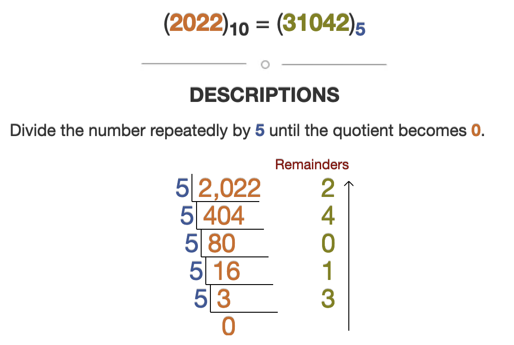

## Part 1

Our final day has two main tasks: converting _from_ SNAFU and _to_ SNAFU. The first half is simple, so let's knock that out.

Our `from_snafu` function is really just following the instructions closely, plus some iteration and math:

```py
MULTIPLIERS = {"2": 2, "1": 1, "0": 0, "-": -1, "=": -2}

def from_snafu(s: str) -> int:
    return sum(5**idx * MULTIPLIERS[c] for idx, c in enumerate(reversed(s)))
```

By reversing the string, we don't have to store anything extra to figure out what order of magnitude we need (otherwise we'd need to know the length of the string at the start). We knock together an iterator and a lookup table and we're good to go.

Converting the other way requires understanding a bit more about the SNAFU system. Given that each place is a power of 5, that should clue you into the fact that we're dealing with a modified base-5 system. As a quick refresher, a base-N numbering system means two things:

1. the number of digits needed to express a number grows by 1 as soon as we reach a new N<sup>x</sup>. e.g. in base 10, we need a new place when we hit 10<sup>1</sup>, 10<sup>2</sup> and 10<sup>3</sup> (`9` -> `10`, `99` -> `100`, and `999` -> `1000`, respectively)
2. a number is the sum of `N`<sup>`index`</sup> for each item in the number. e.g. `1234` is 1 \* 10<sup>3</sup> + 2 \* 10<sup>2</sup> + 3 \* 10<sup>1</sup> + 1 \* 10<sup>0</sup> (1000 + 200 + 30 + 4)

To help get a sense of how SNAFU diverges from pure base-5, let's look at how they compare:

| Base 10 | Base 5 | SNAFU |
| ------- | ------ | ----- |
| `0`     | `0`    | `0`   |
| `1`     | `1`    | `1`   |
| `2`     | `2`    | `2`   |
| `3`     | `3`    | `1=`  |
| `4`     | `4`    | `1-`  |
| `5`     | `10`   | `10`  |
| `6`     | `11`   | `11`  |
| `7`     | `12`   | `12`  |
| `8`     | `13`   | `2=`  |
| `9`     | `14`   | `2-`  |
| `10`    | `20`   | `20`  |
| `11`    | `21`   | `21`  |
| `12`    | `22`   | `22`  |
| `13`    | `23`   | `1==` |
| `14`    | `24`   | `1=-` |
| `15`    | `30`   | `1=0` |
| `16`    | `31`   | `1=1` |
| `17`    | `32`   | `1=2` |
| `18`    | `33`   | `1-=` |
| `19`    | `34`   | `1--` |
| `20`    | `40`   | `1-0` |
| `21`    | `41`   | `1-1` |
| `22`    | `42`   | `1-2` |
| `23`    | `43`   | `10=` |
| `24`    | `44`   | `10-` |
| `25`    | `100`  | `100` |
| `26`    | `101`  | `101` |
| `27`    | `102`  | `102` |
| `28`    | `103`  | `11=` |
| ...     | ...    | ...   |

Do you notice some patterns? Here's what jumped out to me:

1. SNAFU counts with the same pattern as any number system, where each place follows the same pattern (`=-012`) and, upon reaching the end, increments the next number place through its own pattern and then begins its pattern again
2. While base-5 completes its character loop between `0` and `4`, SNAFU's loop is between `3` and `7` (which does make sense when you think about it- that's `-2` and `+2` from 5)

Before we worry about snafu, let's write a straight base 10 -> base 5 converter. This is a pretty well-known algorithm and I found [this great example generator](https://madformath.com/calculators/basic-math/base-converters/decimal-to-base-5-converter-with-steps/decimal-to-base-5-converter-with-steps) (which lets you paste in your own numbers). Here's the steps for converting `2022`:



To convert to base-5, we divide the number by 5 and keep the remainder for an answer. Then, we divide whatever wasn't part of the remainder by 5, take the remainder, and so on. Here's a simple implementation of that using the new-to-me `divmod` function ([docs](https://docs.python.org/3/library/functions.html#divmod)):

```py
def to_base_5(i: int) -> str:
    result = ""

    while i > 0:
        i, remainder = divmod(i, 5)
        result += str(remainder)

    return result[::-1]
```

This works great for base-5, but won't work for SNAFU. Results of 3 and 4 aren't expressible directly, so we'll have to tweak our algorithm.

Let's take a closer look at how base-5 and SNAFU compare, especially these rows:

| Base 10 | Base 5 | SNAFU |
| ------- | ------ | ----- |
| `6`     | `11`   | `11`  |
| `7`     | `12`   | `12`  |
| `8`     | `13`   | `2=`  |
| `9`     | `14`   | `2-`  |
| `10`    | `20`   | `20`  |

For `6` and `7`, they're in sync. Then `8` and `9` get them out of sync (because `13` and `14` aren't translatable). Instead, SNAFU uses `=` as the remainder and increments the next place up. That's what tripped me up initially: how do we manually change the result of the next remainder division? Well, we change the numerator. Let's walk through an example, converting `8` to SNAFU manually.

First, `8 % 5` is `3`. Normally our answer would end with a `3`, but we can't show that in SNAFU. Instead we store `=` and need to make sure the _next_ step results in the next character in the cycle.

The next step is normally is doing floor division followed by another round of modulo; that's `8 // 5` (`1`) and `1 % 5` (also `1`), giving us our base-5 answer of `13`. But, we need that first `1` to be a `2` instead. `9 // 5` also gives `1`, but `10 // 2` will give us what we need for `2 % 5` to be `2`. We can get from `8` to `10` programmatically because modulo division always tells you how far you were from a multiple of the divisor. For instance, `8 % 5` is `3`, meaning `8` is `5-3` away from a multiple of 5. That's true! `8` is `2` less than `10`.

So, for snafu, we'll mostly do normal base-5, but when the remainder is `3` or `4`, we have to modify the number before continuing division. Here's what that looks like:

```py
def to_snafu(i: int) -> str:
    result = ""

    while i > 0:
        remainder = i % 5

        if remainder >= 3:
            result += {3: "=", 4: "-"}[remainder]
            i += 5 - remainder
        else:
            result += str(remainder)

        i //= 5

    return result[::-1]
```

Putting those two pieces together, gives us:

```py
def part_1(self) -> str:
    target = sum(from_snafu(line) for line in self.input)
    return to_snafu(target)
```

## Part 2

That's a wrap! If you don't have all 49 stars, now's a great time to go back through [the rest of the solutions](https://github.com/xavdid/advent-of-code/tree/main/solutions/2022) and fill in anything you're missing.

If you've enjoyed reading these posts as much as I've enjoyed making them, please [drop me a line](https://xavd.id/contact/) and let me know! I always love hearing that people are actually reading these explanations.

When you're ready, go ahead and hit the button. Great job making it this far, seriously. See you next year!
