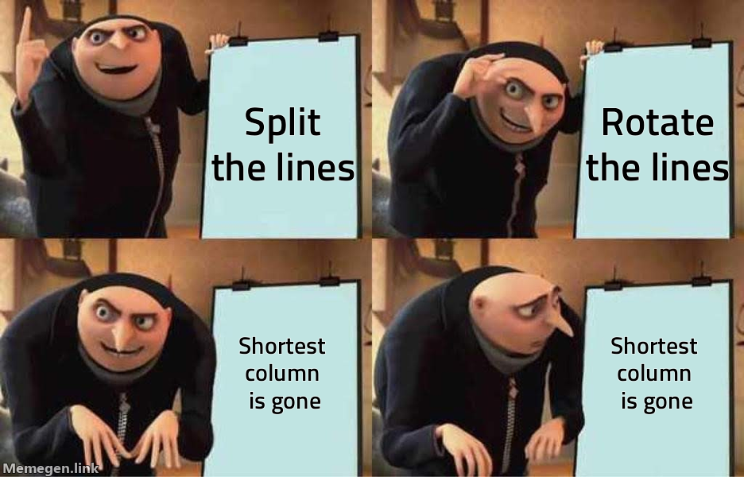

## Part 1

This may take the cake for the oddest AoC input format we've ever seen. Luckily, it's small enough that we can just hard-code the initial stack state, which will let us focus on the meat of the problem:

```py
class Solution(StrSplitSolution):
    ...

    def parse_stacks(self):
        # !! REPLACE WITH YOUR INPUT
        return [
            [], # to make the stacks 1-indexed
            # <-- bottom of the stack is on left
            list("FTCLRPGQ"),
            list("NQHWRFSJ"),
            list("FBHWPMQ"),
            list("VSTDF"),
            list("QLDWVFZ"),
            list("ZCLS"),
            list("ZBMVDF"),
            list("TJB"),
            list("QNBGLSPH"),
        ]
```

For the purists among you[^1] who insist that an AoC solution is only done when it can handle any valid input without modification, skip down to [input parsing](#parsing-the-stacks) before continuing on. I personally did the actual input parsing last, but you do you.

### Part 1 (for real)

Stack input parsing aside, day 5's bark is worse than its bite. Parsing the instructions is pretty simple:

```py
class Solution(StrSplitSolution):
    separator = "\n\n" # so the stacks and instructions are separate

    ...

    def parse_instructions(self):
        for l in self.input[1].split("\n"):
            _, num, _, src, _, dst = l.split(" ")
            yield int(num), int(src), int(dst)
```

We use a generator function so that instructions are computed one at a time. This prevents us having to store all the parsed instructions at once (useful if there could be tons of them). We also use `_` as a variable name, the Python convention for "unused variable".

Next, moving the actual stacks. We need to:

1. remove a number of items from the `src` stack
2. reverse that group
3. add it to the destination stack

Python's list slices make surprisingly short work of this:

```py
class Solution(StrSplitSolution):
    ...

    def part_1(self) -> str:
        stacks = self.parse_stacks()

        for num, src, dst in self.parse_instructions():
            stacks[dst] += stacks[src][[: -num - 1 : -1]]
            del stacks[src][-num:] # Python can delete a slice!
```

The `stacks[src][: -num - 1 : -1]` is doing most of the work here, so let's step through it.

You're probably familiar with Python's list slices. They're how we can get specific sub-lists out of lists (like "the first 3 items", the "last 2 items", or "from the 1st item to the end"). What you may not know is that they can have up to 3 parts.

The full syntax is `[start : stop : step]`. If any argument is missing, it falls back to a default (0, "end of list" and 1, respectively). Most iterations step by 1, so you don't see the third part often. But, it's perfect for us here! Provide a negative step and you'll get the list backwards, which is exactly how one might reverse a dynamically sized bit of list.

If we _just_ wanted the last 3 of a stack, we could use `[:-3]`. And if we wanted to reverse the whole thing, we could use `[::-1]` (to step through in reverse order). But, combining them, we swap our start to the stop position, because we're going in reverse. All together:

```py
[1,2,3,4,5,6,7,8,9][-3:] # [7, 8, 9]
[1,2,3,4,5,6,7,8,9][::-1] # [9, 8, 7, 6, 5, 4, 3, 2, 1]
[1,2,3,4,5,6,7,8,9][-3::-1] # [7, 6, 5, 4, 3, 2, 1]; wrong!
[1,2,3,4,5,6,7,8,9][:-4:-1] # [9, 8, 7]; bingo!
```

Because we're using the stop position, we have to increase the value by 1, because slices work like `range`s do (the `stop` isn't included). But, we're stepping backwards, so we decrement it by 1- that's why `[:-4:-1]` gives us the last 3 elements.

Anyway! All that remains is to return the last element in each stack:

```py
...
return "".join(s[-1] for s in stacks[1:])
```

## Part 2

Ironically, part 2 is simpler because we no longer need to reverse the list. Instead, we can use the much more pedestrian `[-3:]` to get the last 3 of the list. But, if we want to avoid writing the same function twice, we need a way to programmatically specify our slice indexes. It's easy enough to put variables between existing colons in a slice, but we need to change the shape of the colons entirely.

It turns out there are two ways to do this. We could take advantage of the fact that `None` is a valid input for a slice part, it'll gracefully fall back to the default. So we could have our crane us `[a:b:c]` and have a function return all 3 of those values every time (some of which will be `None`).

Or, we take advantage of a little-used global function: `slice`. It turns out, this is what backs all complex slice iterations! It can be used in a list lookup to do the same thing:

```py
# same answers results as above
[1,2,3,4,5,6,7,8,9][slice(-3, None)]
[1,2,3,4,5,6,7,8,9][slice(None, None, -1)]
[1,2,3,4,5,6,7,8,9][slice(-3,None,-1)]
[1,2,3,4,5,6,7,8,9][slice(None, -4, -1)]
```

Used in conjunction with our lambda-injection pattern from [yesterday](/writeups/2022/day/4/#and-another-one), we can write some pretty clean code. Check this out:

```py
from typing import Callable

class Solution(StrSplitSolution):
    ...

    # slicer is a function that takes an int and returns a slice object
    def _solve(self, slicer: Callable[[int], slice]) -> str:
        stacks = self.parse_stacks()

        for num, src, dst in self.parse_instructions():
            stacks[dst] += stacks[src][slicer(num)]
            del stacks[src][-num:]

        return "".join(s[-1] for s in stacks[1:])

    def part_1(self) -> str:
        return self._solve(lambda num: slice(None, -num - 1, -1))

    def part_2(self) -> str:
        # None as a second arg is important,
        # because slice(1) -> slice(None, 1, None) (aka `[:1]`)
        return self._solve(lambda num: slice(-num, None))
```

And that should do it for day 5!

---

## Parsing the Stacks

Welcome to the Sicko Zone ([context](https://knowyourmeme.com/memes/sickos-haha-yes)). Let's parse this thing.

<p align="center">
  
</p>

Normally when we parse input data, everything we need is in the same row. This lends itself well to reading lines from a file. Unfortunately, that's not the case here. Our relevant data is in the same _column_, but we have to read the whole block at once to be able to start parsing it.

I had two ideas. The first idea was to get the index of each number in the bottom row and then walk up the lines backward, getting the letter at that index in each previous line (stopping once we hit a space). This would have worked, but because my editor strips trailing whitespace ([as should yours](https://softwareengineering.stackexchange.com/questions/121555/why-is-trailing-whitespace-a-big-deal)), every line of the stacks isn't actually the same length. In the sample input, stack 3 is the shortest, so the line above that (starting with `[N]`) will give an out-of-bounds error if we try to read all the way over to the third column. We can fix this by padding the string with spaces, but it still felt a little messy. Instead, let's "rotate" the data so it's more in line with what we're used to parsing!

Python has a global function, `zip`, which takes any number of iterables and returns the first of each, second of each, etc:

```py
list(zip('ABC', '123'))
# [('A', '1'), ('B', '2'), ('C', '3')]
```

If we use that in conjunction with the spread operator discussed [yesterday](/writeups/2022/day/4/), we can `zip` the lines in our stacks so each character in the top line becomes the beginning of a new string, each character in the second line is the second character, etc. Here's how that looks with the sample input:

```py
list(zip(*lines.split('\n')))

#     [D]
# [N] [C]
# [Z] [M] [P]
#  1   2   3

# becomes

[
    (' ', '[', '[', ' '),
    (' ', 'N', 'Z', '1'),
    (' ', ']', ']', ' '),
    (' ', ' ', ' ', ' '),
    ('[', '[', '[', ' '),
    ('D', 'C', 'M', '2'),
    (']', ']', ']', ' ')
]
```

Which is _mostly_ usable, though there are a couple of issues. Firstly, our lines are backwards- the number is all the way on the right and the letters are in the reverse order of how we're stacking boxes (bottom is on the left). That's fixable, we can reverse the lines before we zip. More importantly, we seem to have lost a column!



That's because `zip` stops as soon as _any_ of the iterables end:

```py
list(zip('ABC', '12'))
# [('A', '1'), ('B', '2')]
```

Luckily, there's a `zip_longest` in `itertools` which will fix this for us. It adds `None` where there are holes. Combine that with the `reverse` we discussed above and we have a pretty usable data structure:

```py
list(zip_longest(*reversed(s.split('\n'))))

# becomes

[
    (' ', '[', '[', ' '),
    ('1', 'Z', 'N', ' '),
    (' ', ']', ']', ' '),
    (' ', ' ', ' ', ' '),
    (' ', '[', '[', '['),
    ('2', 'M', 'C', 'D'),
    (' ', ']', ']', ']'),
    (' ', ' ', None, None),
    (' ', '[', None, None),
    ('3', 'P', None, None),
    (None, ']', None, None)
]
```

With the tricky part out of the way, we can now package a selection of these lines into our stacks:

```py
class Solution(StrSplitSolution):
    ...

    def parse_stacks(self):
        lines = self.input[0].split("\n")
        misc_groups = zip_longest(*reversed(lines))
        # add an empty at the beginning so stacks are 1-indexed
        result = [[]]

        for group in misc_groups:
            head = group[0] or ""
            # filter out lines that don't start with a numeric string
            if not head.strip().isdigit():
                continue

            # create the list, filtering out `None` and `' '`
            result.append([c for c in group[1:] if c and c.strip()])

        return result
```

There. Are you happy? We've done it. Now you can [pick up where we left off](#part-1-for-real) if you came here first. Otherwise, congrats on conquering one of the oddest inputs we've ever seen!

[^1]: Myself included, tbh
