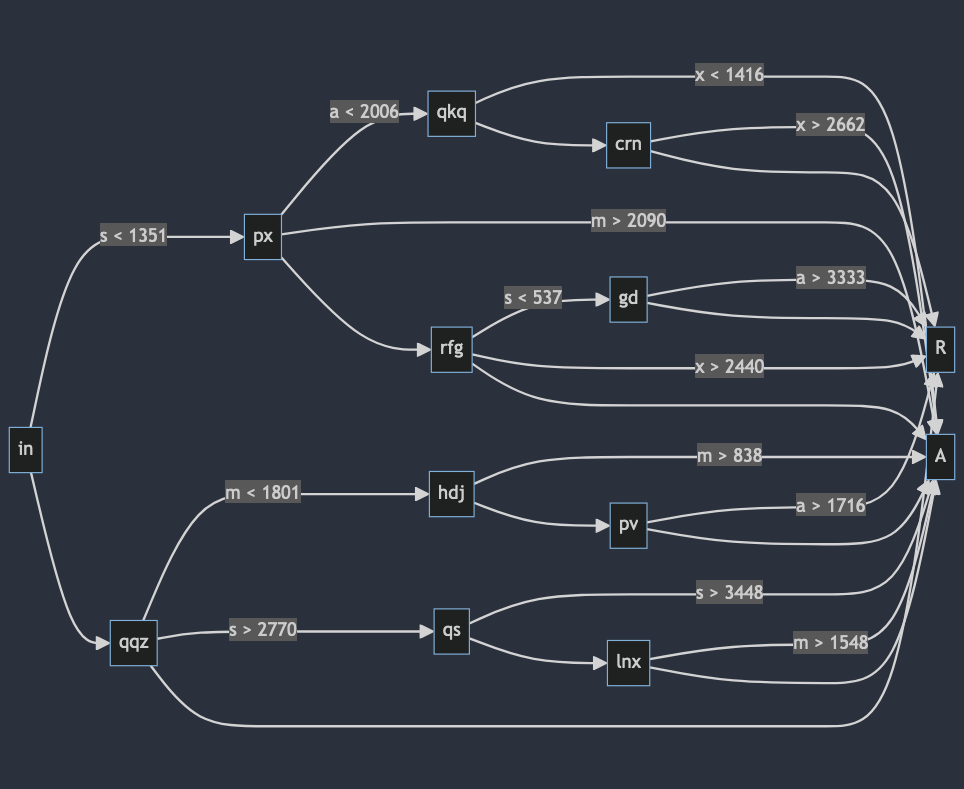
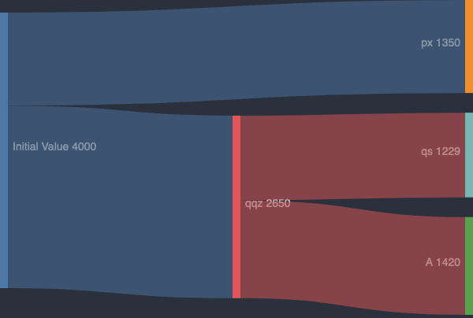

## Part 1

This is the kind of puzzle I enjoy. It involves following the instructions closely, dynamic programming and some regex.

At a high level, we need to write a function that can run through each of our `Part`s (that hold the the `xmas` numbers) and apply workflows until we resolve either an `A` or `R`. To do that, we need to parse the `Part`s and, much trickier, parse workflows. We'll start with the easy one.

Parts are always in the same order and well formed, so we can use a regex to find every pair of `letter=number`s. Our output is a `dict` (which will make lookups easy later). This is straightforward:

```py
import re

Part = dict[str, int]

def parse_part(line: str) -> Part:
    return {k: int(v) for k, v in re.findall(r"(.)=(\d+)", line)}

# parse_part("{x=787,m=2655,a=1222,s=2876}")
#   -> {'x': 787, 'm': 2655, 'a': 1222, 's': 2876}
```

A `dict` comprehension makes easy work of our first task and gives us the first piece of the puzzle. Now for the good stuff.

For each workflow (starting with `in`) we need to run basically this pseudocode:

```py
def run_workflow(part: Part, workflow: ...):
    for filter_func in workflow.filters:
        if destination := some_calculation(...)
            return destination

        return workflow.default
```

We'll have a dict of `key => workflow` do the lookups, but the exact nature of that `run_workflow` remains to be determined. Let's break it into component pieces.

For each line in the input, we need to extract its key, the filters, and the default. A regex makes short work of this:

```py
def parse_workflow(raw_workflow: str):
    if not (match := re.search(r"(.*){(.*),(.*)}", raw_workflow)):
        raise ValueError(f"unable to parse workflow: {raw_workflow}")

    key, raw_filters, default = match.groups()
    # ('px', 'a<2006:qkq,m>2090:A', 'rfg')
```

That gives us our key and result. Next, we need to parse the middle part into callable functions. Each string has a pretty rigid structure (letter, operation, value, `:`, label), so it's easy enough to generate to usable Python components:

```py
from operator import gt, lt

def extract_filter_components(
    f: str,
) -> tuple[str, Callable[[int, int], bool], int, str]:
    category = f[0]
    op = lt if f[1] == "<" else gt
    value_str, destination = f[2:].split(":")

    return category, op, int(value_str), destination
```

The only tricky thing is that we're turning `<` and `>` into their matching functions from the `operator` package (which are the actual implementations of those operators).

We now have everythign we need to turn a `raw_workflow` string into a single function that takes a `Part` and returns `str`. Here's everything together (replacing our pseudocode from before):

```py
def build_workflow(raw_filters: str, default: str) -> Callable[[Part], str]:
    def _get_next_destination(part: Part):
        for raw_filter in raw_filters.split(","):
            category, op, value, destination = extract_filter_components(raw_filter)
            if op(part[category], value):
                return destination

        return default

    return _get_next_destination
```

Which finishes our workflow parsing implementation:

```py ins={7}
def parse_workflow(raw_workflow: str) -> tuple[str, Callable[[Part], str]]:
    if not (match := re.search(r"(.*){(.*),(.*)}", raw_workflow)):
        raise ValueError(f"unable to parse workflow: {raw_workflow}")

    key, raw_filters, default = match.groups()

    return key, build_workflow(raw_filters, default)
```

We can now finally start our actual solution:

```py
...

class Solution(TextSolution):
    separator = "\n\n"

    def part_1(self) -> int:
        workflows_block, parts_block = self.input

        workflows = dict(
            parse_workflow(workflow_line)
            for workflow_line in workflows_block.splitlines()
        )
```

We're using the `dict([(key, value), ...])` form of the `dict` constructor, which lets us easily turn all our workflows into useful functions. Let's circle back to actually scoring our `Part`s.

Given that we're working with a tree structure, recursion is a good place to start. Our base case is a check for the `key` being `R` or `A`. Otherwise, we'll recurse with the result of running that workflow. We'll call our recursive function on each `Part` and sum the result:

```py ins={12-50}
...

class Solution(TextSolution):
    def part_1(self) -> int:
        workflows_block, parts_block = self.input

        workflows = dict(
            parse_workflow(workflow_line)
            for workflow_line in workflows_block.splitlines()
        )

        def score_part(part: Part, workflow_key: str) -> int:
            if workflow_key == "R":
                return 0
            if workflow_key == "A":
                return sum(part.values())

            return score_part(part, workflows[workflow_key](part))

        return sum(
            score_part(parse_part(raw_part), "in")
            for raw_part in parts_block.splitlines()
        )
```

It's more code than most days but it's not too bad when it's all set and done. On to part 2!

## Part 2

The example answer being more than 100 trillion should clue you into the fact that we'll be taking a math-y approach, not an iterative one. Instead of doing testing individual `Part`s, we need to know how many parts _would_ end up in each bucket if we tested them all.

I initially had a lot of trouble conceptualizing the solution, so I actually started with a diagram before writing any code. Here's a flowchart of the paths from the example (generated using [Mermaid.js](https://mermaid.js.org/); click the image to see the source):

[](https://mermaid.live/edit#pako:eNplkstugzAQRX_FmjVENsbmoQipUpftpt1VbCwgjya8SUoS5d87ME1kVEtIHp_LnfF4bpDVeQExbI71T7Yz3cDePtKK4cq6irkuG1nCPK093LsJe7FZwv6k23xSGlRKXKS00TPa5d-TskRlKENmORJJWHOmeD8n79maCakEodFCCWvbK8XHanyYCuWHi0KJPcPm_ChUBEIvCm1GQmvmca4pw6G12ZTA4xH_Z2iFlK3bbClGB-ohXsMX2v6TUDK18u-gvVIW1IZckC-2ZUH7qYYgoBra3mbPm7T9Qyl9f9HkmSRTUyjGOh9dVjKY2TZfoPn1fZ_b_oTQFBwoi640-xwH6DbBFIZdURYpxLjNTXdIIa3uqDOnof68VBnEQ3cqHDg1uRmK173ZdqaEeGOOPZ4W-X6ou3eayHkwHWhMBfENRojdaCW5xHfTKlK-CqPQgQvEOlpx6UdaKaGE1IF3d-Ba1-jKV5FSEj8dKK6Ridnua4ZzyvsvAEHCGw)

If we _only_ used workflow `in` and we only used `s` values (not all of `xmas`), then 1,350 parts would go to `px` and the remaining 2,650 (`4000 - 1350`) would go to the default (`qqz`). That's easy enough and requires no iteration, which is a good sign.

Now let's add the other letters. We start with 4,000<sup>4</sup> possible parts (because you have every combination of number, so you have to multiply the count in each category). After the first split they're put in two buckets (the group that passed the filter and the default group):

1. `px`: `xma` values `(1, 4000)` and `s` values `(1, 1350)`
2. `qqz`: `xma` values `(1, 4000)` and `s` values `(1351, 4000)`

If we stopped right there, the number of parts in bucket 1 would be `4000 * 4000 * 4000 * 1350`. But, we're not done; we have to keep cutting those ranges until we hit `A` or `R`.

If we follow the `qqz` branch through its middle fork, we'll cut both `m` and `s` ranges. This turns bucket `2` above into 3 _more_ groups:

3. `xa` values `(1, 4000)`, `m` values `(1, 1800)`, and `s` values `(1351, 4000)`
4. `xa` values `(1, 4000)`, `m` values `(1801, 4000)`, and `s` values `(2771, 4000)`
5. `xa` values `(1, 4000)`, `m` values `(1801, 4000)`, and `s` values `(1351, 2771)`

Each time we apply a filter, we split letter's range into smaller parts. The pattern becomes even more apparent when you visualize the values of `s` after each cut with a [Sankey diagram](https://en.wikipedia.org/wiki/Sankey_diagram):

[](https://mermaid.live/edit#pako:eNptj0FvhCAQhf8KmTMaEWEXbk176aGnJj00XKiyW6KCIibrGv97WU3TSw-TzMz38t7MCrVvDEjIsky52ruLvUrlEJq0a82ytwh11rXPvvNBosnPoTbK7fpDlH2ZqA_hq7PR6g596G42eLhhQlnxHxrHOy75L3tM44QwKUvxt3nCpCoLwNCb0GvbpCvXB1UQv01vFMjUNjq0CpTbkk7P0b8vrgYZQ8qAeWh0NC9WX4PuQV50N6WtaWz04e14e_8ew6AdyBVuIDOR04KeCOdMsIqdxRnDApKLvKCV4IwRRig_lRuGu_fJtcgFYzQVP7GCJ0Z2u88d7pHbD1nQa_A)

That diagram only tracks `s`, but the other 3 letters go through similar (totally independent) reductions as we move down the tree.

Code wise, we've got most of the tools we need to do this already, but we'll need to change how we store and process `Part`s. Before, a `Part` was a simple mapping of the category letters to their value. For part 2, those `int`s are `range`s instead. Each time we process a workflow, it'll return 2+ smaller parts that will filter down to other workflows.

This means a new version of `build_workflow` that works with ranges and returns lists instead of single strings (with changes highlighted):

```py del={3,14} ins={1,4,6,8,15}
RangedPart = dict[str, range]

def build_workflow(raw_filters: str, default: str) -> Callable[[Part], str]:
def build_counting_workflow(
    raw_filters: str, default: str
) -> Callable[[RangedPart], list[tuple[str, RangedPart]]]:
    def _get_next_destinations(part: RangedPart):
        ranges: list[tuple[str, RangedPart]] = []

        for raw_filter in raw_filters.split(","):
            category, op, value, dest = extract_filter_components(raw_filter)
            # TODO

        return default
        return ranges

    return _get_next_destinations
```

We'll get to actual implementation soon, but let's peek at our `part_2` function to understand where we're headed. It also looks similar to part 1, but adds while it recurses:

```py del={6,11,18,21,24-27} ins={7,12-13,19,22,28} ins=": RangedPart"
...

class Solution(StrSplitSolution):
    ...

    def part_1(self) -> int:
    def part_2(self) -> int:
        workflows_block = self.input[0]
        workflows = ... # dict of workflow functions that return RangedParts, TBD

        def score_part(workflow_key: str, part: Part) -> int:
        def score_workflow(next_workflow: tuple[str, RangedPart]) -> int:
            workflow_key, part = next_workflow

            if workflow_key == "R":
                return 0
            if workflow_key == "A":
                return sum(part.values())
                return prod(len(r) for r in part.values())

            return score_part(workflows[workflow_key](part), part)
            return sum(map(score_workflow, workflows[workflow_key](part)))

        return sum(
            score_part("in", parse_part(raw_part))
            for raw_part in parts_block.splitlines()
        )
        return score_workflow("in", {k: range(1, 4001) for k in "xmas"})
```

Our final focus is the new workflow parser that returns a list of `tuple[str, RangedPart]`. Running it on workflow `in` should give us:

```py
[('px',
  {'a': range(1, 4001),
   'm': range(1, 4001),
   's': range(1, 1351),
   'x': range(1, 4001)}),
 ('qqz',
  {'a': range(1, 4001),
   'm': range(1, 4001),
   's': range(1351, 4001),
   'x': range(1, 4001)})]
```

Since the only rule is `s < 1351`, everything else in unchanged. The core of this solution is being able to bisect a `range` at a point. Given `range(1, 4001)` and `1351`, we should get `(range(1, 1351), range(1351, 4001))`. That's easy to write:

```py
def bisect_range(r: range, value: int) -> tuple[range, range]:
    """
    split a range in two at `value` (which is excluded from the bottom range but included in the top one)
    """
    return range(r.start, value), range(value, r.stop)
```

Now we can actually turn a part and a filter into two parts, split at the exact right spot. One of those ranges is what gets sent onto the next workflow and the other stays in the current one as fodder for the next filter (or default). The `<` and `>` cases are opposites. `<` sends the lower part of the range onward and "keeps" the higher half for more filter; `>` does the inverse. The two ranges come back as `low, high`, so they're easy to descructure accordingly:

```py ins={10-13,15-16} ins=" + [(default, part)]"
def build_counting_workflow(
    raw_filters: str, default: str
) -> Callable[[RangedPart], list[tuple[str, RangedPart]]]:
    def _get_next_destinations(part: RangedPart):
        ranges: list[tuple[str, RangedPart]] = []

        for raw_filter in raw_filters.split(","):
            category, op, value, dest = extract_filter_components(raw_filter)

            if op == gt:
                keep, send = bisect_range(part[category], value + 1)
            else:
                send, keep = bisect_range(part[category], value)

            ranges.append((dest, {**part, category: send}))
            part = {**part, category: keep}

        # whatever is left also goes
        return ranges + [(default, part)]

    return _get_next_destinations
```

Note that the `value + 1` in the `gt` case is **very important** to this solution. Because `bisect_range` makes the `value` the bottom of the "high" `range`, `gt` ranges will be off-by-1 (which cascades into an off-by-14-billion). Ask me how I know 🙈. Anyway, once we're bisecting our `Part` correctly, we append it to the results and modify the `part` we're working on (returning whatever's left when we're done).

All that in hand, we can finally finish our solution by parsing workflows. If you remember, part 1's `parse_workflow` handled that with a regex and calling `build_workflow(raw_filters, default)`. We need that same thing again, but with our new `build_counting_workflow` instead. Rather than make a nearly-identical parsing function that changes one thing, let's make it configurable:

```py del={1,4} ins={2,5} ins=", builder: Callable[[str, str], T]" ins="builder("
def parse_workflow(
def parse_workflow[T](
    raw_workflow: str, builder: Callable[[str, str], T]
) -> tuple[str, Callable[[Part], str]]:
) -> tuple[str, T]:
    if not (match := re.search(r"(.*){(.*),(.*)}", raw_workflow)):
        raise ValueError(f"unable to parse workflow: {raw_workflow}")

    key, raw_filters, default = match.groups()

    return key, builder(raw_filters, default)
```

This new syntax makes great use of Python 3.12 [generic type parameters](https://docs.python.org/3/whatsnew/3.12.html#pep-695-type-parameter-syntax). Because `parse_workflow`'s return type depends on the type of the `builder` argument, we express them in terms of each other: `parse_workflow` now returns a tuple of whatever the return type of `builder` is. This generic means that `workflows` is now correctly typed in both places it's used:

```py del={9} ins={10,17-20}
...

class Solution(TextSolution):
    separator = "\n\n"

    def part_1(self) -> int:
        workflows_block, parts_block = self.input
        workflows = dict(
            parse_workflow(workflow_line)
            parse_workflow(workflow_line, build_workflow)
            for workflow_line in workflows_block.splitlines()
        )
        ...

    def part_2(self) -> int:
        workflows_block = self.input[0]
        workflows = dict(
            parse_workflow(workflow_line, build_counting_workflow)
            for workflow_line in workflows_block.splitlines()
        )
        ...
```

A fact VSCode (with the [Pylance plugin](https://marketplace.visualstudio.com/items?itemName=ms-python.vscode-pylance)) confirms for part 1:

![editor screenshot showing "(variable) workflows: dict[str, (Part) -> str]"](./images/type-part-1.png)

and part 2:

![editor screenshot showing "(variable) workflows: dict[str, (RangedPart) -> list[tuple[str, RangedPart]]]"](./images/type-part-2.png)

And that'll do it! Great job today. This one was conceptually tricky, but ended up being pretty fun in the end.
