## Part 1

Today we're tracking signals through modules in a big computer. We'll be tracking the signals sent and adjusting state accordingly. This design immediately screamed [Object Oriented Programming](https://en.wikipedia.org/wiki/Object-oriented_programming), since we can have a base `Module` to implement shared properties and child classes which handle the different module types. Let's talk through our overall design and then dig into the actual implementations.

We'll need 2 modules: `FlipFlopModule` and `ConjunctionModule`. They'll each have a `send` method which takes information about the received pulse and returns a list of new pulses to send. A pulse will be a 3-tuple of `from, is_high_pulse, to`, describing the two involved modules and the low/high status (like the diagram in the prompt).

The logic for the modules themselves is quite straightforward. We'll start with the base class:

```py
from dataclasses import dataclass

# from, high pulse?, to
Pulse = tuple[str, bool, str]


@dataclass
class BaseModule:
    name: str
    targets: list[str]

    def build_pulses(self, is_high_pulse: bool) -> list[Pulse]:
        return [(self.name, is_high_pulse, t) for t in self.targets]

    def send(self, source: str, is_high_pulse: bool) -> list[Pulse]:
        raise NotImplementedError()

    def store_sources(self, sources: list[str]):
        raise NotImplementedError()
```

Because we want methods that interact with modules to take a `BaseModule` as their argument, it's useful to define all the methods a descendant class _could_ implement (even if it raises a runtime error when called).

Our first real module is the `FlipFlopModule`, which tracks an internal `state` and only broadcasts on low pulses. That code is straightforward:

```py
...

class FlipFlopModule(BaseModule):
    state = False

    def send(self, _: str, is_high_pulse: bool) -> list[Pulse]:
        # high pulses are ignored
        if is_high_pulse:
            return []

        # otherwise, invert and send new state pulse to all targets
        self.state = not self.state

        return self.build_pulses(self.state)
```

Note that we didn't redefine `store_sources`, so that'll be an unexpected error if it ever gets called (which is fine).

Next is the `ConjunctionModule`. It has to know all the modules that send _to_ it. Unfortunately, we can't do this lazily, since a single high pulse would make it remember `high` for "every" input, triggering it incorrectly. Instead, we'll have to do a couple of passes on the parsing; we'll get to that soon. In the meantime, here's the code to register those sources and send pulses:

```py
class ConjunctionModule(BaseModule):
    _sources: dict[str, bool] = {}

    def send(self, source: str, is_high_pulse: bool) -> list[Pulse]:
        self._sources[source] = is_high_pulse

        # if all high, send low
        # else, high
        to_send = not all(self._sources.values())

        return self.build_pulses(to_send)

    def register_sources(self, sources: list[str]):
        if self._sources:
            raise ValueError("already registered sources!")
        self._sources = {s: False for s in sources}
```

Finally, we're ready to parse the input. My approach does 3 passes, which I'm not super pleased with. Unfortunately, I needed to pre-identify each of the conjunction modules so I could identify which modules are pointed at them. So, let's see the three passes. We'll be building a new class to house all the business logic:

```py
...

class Computer:
    def __init__(self, lines: list[str]) -> None:
        # first pass: identify conjunction modules and initialize an empty array of what points at them
        conj_modules = {
            line.split(" ")[0][1:]: [] for line in lines if line.startswith("&")
        }
```

A little terse, but simple enough. Now before parsing any actual modules, we know which ones will be conjunction type.

Next, we'll actually initialize all our classes in a `dict`:

```py
...

class Computer:
    modules: dict[str, BaseModule] = {}

    def __init__(self, lines: list[str]) -> None:
        ...

        # second pass: generate and store BaseModule classes
        for line in lines:
            raw_source, raw_target = line.split(" -> ")
            source = raw_source[1:]
            targets = raw_target.split(", ")

            for t in targets:
                if t in conj_modules:
                    conj_modules[t].append(source)

            if raw_source == "broadcaster":
                self.initial_targets = targets
            if raw_source.startswith("%"):
                self.modules[source] = FlipFlopModule(source, targets)
            if raw_source.startswith("&"):
                self.modules[source] = ConjunctionModule(source, targets)
```

Crucially, we're telling each conjunction module which modules (of any type) point at it. This becomes vital for the third pass, where we register those sources:

```py
...

class Computer:
    ...

    def __init__(self, lines: list[str]) -> None:
        ...

        # third pass: update existing conjunction module with their sources
        for k, v in conj_modules.items():
            self.modules[k].register_sources(v)
```

Now those modules will correctly handle pulses because they have their full input list.

Next, we push the button! We're building a queue that each mode will add to. We also have to track the counts of our low and high pulses. Luckily, Python's got built-in classes to make short work of both of these: `collections.deque` and `collections.Counter`. The `deque` allows fast pushing and popping from both sides of the list, which is vital for queue-like behavior. `Counter`s can be added together, so we can track each pulse type separately, but in a single variable (which will be useful in just a sec). In the meantime, here's our `push_button` method:

```py
...

class Computer:
    ...

    def push_button(self) -> Counter:
        queue: deque[Pulse] = deque(
            ("broadcaster", False, t) for t in self.initial_targets
        )

        # False starts at 1 for button -> broadcaster
        pulse_counts = Counter({False: 1})

        while queue:
            source, pulse, target = queue.popleft()
            pulse_counts[pulse] += 1

            # ignore writing to `rx` or `output`
            if target not in self.modules:
                continue

            queue += self.modules[target].send(source, pulse)

        return pulse_counts
```

Modules can return any number of new states from their `send` method (including 0), which all plays nicely with the `deque`. The method won't return until every pulse is resolved, which is what the spec requires.

All that remains is to push the button 1000 times! And because we're using a `Counter`, which can be added to itself, we can write this very concisely:

```py
...

class Computer:
    ...

    def count_pulses(self) -> int:
        totals = sum((self.push_button() for _ in range(1000)), Counter())

        return totals[False] * totals[True]
```

This takes advantage of a new-to-me fact: `sum` can take a `start` parameter! Without it, we get a fairly cryptic type error:

```py
from collections import Counter

a = Counter({"a": 1, "b": 2})
b = Counter({"b": 2, "c": 3})
a + b  # Counter({'b': 4, 'c': 3, 'a': 1})

# 🤔
sum([a, b]) # TypeError: unsupported operand type(s) for +: 'int' and 'Counter'

# 💡
sum([a, b], Counter())  # Counter({'b': 4, 'c': 3, 'a': 1})
```

That's because `sum` assumes it's adding numbers, so `start` is `0` by default. If we're adding anything else, we should seed it with that type.

And just like that, we have our totals! Returning those gives us our answer:

```py
...

class Solution(StrSplitSolution):
    def part_1(self) -> int:
        return Computer(self.input).count_pulses()
```

## Part 2

I spent a non-trivial amount of time writing code for part 1 that would find a loop in the states. The prompt made it sound like I'd need such code for part 2. Unfortunately, that all got thrown out when it became clear that my full input wasn't going to loop in any reasonable time. Nor, it turns out, was it going to fire a single low pulse at `rx` in a reasonable time.

Taking a cue from [day 8](/writeups/2023/day/8/#part-2), I wrote some code to dump the input into [mermaid](https://mermaid.js.org/) flowchart:

```py
lines = []
for line in self.input:
    raw_source, raw_target = line.split(" -> ")
    source = raw_source[1:]
    targets = raw_target.split(", ")

    for t in targets:
        if raw_source == "broadcaster":
            lines.append(f"  {raw_source} --> {t}")
        if raw_source.startswith("%"):
            lines.append(f"  {source} --> {t}")
        if raw_source.startswith("&"):
            # conjunction modules will be diamonds
            lines.append(f"  {source}{{{source}}} --> {t}")
```

Which gives:

```
flowchart TD
  bh --> cp
  bh --> hd
  bk --> nc
  bm --> tn
  broadcaster --> dv
  broadcaster --> lf
  ...
```

Plug that into the visualizer and an interesting picture emerges:

[](https://mermaid.live/edit#pako:eNptlb2ymzAQhV_Fo9r3BVykum2qpMrQgASSQRIgyUQxw7vH7FFmNrru-M4u-6dF7ELOqhc3Mdj5tzRtSJefn42_XLowt0q2MfXh8vHx7aK2d6od3qmrfqemjlRDIBcGRhFMBF4SOLzjCSKSjQSJYMwE21dw9gS5sNAFIoWWmaAzJyizK3OQECiICrsKEBQ8eIoC0RFkbgFs8YRBovp0gkZfHVk0KvGeAZrUCN1NDDYq2HToa2BQLGo36mDhmSBzJeipEqyvBJwbE1I4hRHFZEo55n3MB1sJJoy1MA2V4E0lrK4SYi0g7TSgS8owlU2hhbIDG2KBTG5Ww_JkgLnZkY2oADbFeoKFpmnLYWkGyOMki-aQ1JKbs2wpCqxUqHsSDPSOxzGajgGieYSeJgbFghY0fTre7N7wPfWo3FPrHke2KAaofFEYpGNQLJHNoUCknlbU1yUGaHDV7J0CkT7T1bENiJK5Rc3WMfIAcfwKWNLo2IIlVJAMA0wo4T7RcPN78gebORNwbzHBPSsBh84FXwnZ1QLShj39d4EkXFh2YYCJJ2yEkwzQyCb3TR7sQmCCCpUw1R64KZiAq5cLVNkW2VEWwAeZcWCKLNnt2fGOcrlon-IqXB9ce1evP8h-mhqRTO_6Rtxej6oNUyMaf7z82keaf_zxUtxSePRX8VhUm_rPe6tD68RtaG18qb26pzl8xy-J_kxXsbT-1zz_8zn-Aoh7-8Q)

While it's processed as one big graph, it's actually 4 subgraphs that all feed into the `rx` module via a series of conjunction modules. A conjunction module with a single input is basically an inverter. So the puzzle of:

> when does `rx` get a single low pulse?

boils down to:

> when do all 4 of the modules pointing at `rx` send a high pulse in the same round?

Realizing that each of those subgraphs probably loops, there'll eventually be a round when they've synced up. The round whre `rx` gets a low pulse will be the [Least Common Multiple](https://en.wikipedia.org/wiki/Least_common_multiple) of those 4 rounds.

Without an example input to test against, I decided to move forward with this naive approach and re-evaluate if needed. So I started simple, by printing out on which round I sent a high pulse to the end of my 4 subgraphs:

```py ins=", i: int" ins="5000" ins="self.push_button(i) for i" ins={11-13}
...

class Computer:
    ...

    def push_button(self, i: int) -> Counter:
        ...

        while queue:
            source, pulse, target = queue.popleft()
            # these were from my input - your strings will be different
            if source in {"xm", "tr", "nh", "dr"} and pulse:
                print(f'writing high to {source} at {i + 1}')

            ...

    def count_pulses(self) -> int:
        totals = sum((self.push_button(i) for i in range(5000)), Counter())

        return totals[False] * totals[True]
```

This blew up my answer from part 1, but that was fine (for now). Running this, I got:

```
writing high to tr at 3739
writing high to xm at 3761
writing high to dr at 3797
writing high to nh at 3889
```

By calling `math.lcm(3739, 3761, 3797, 3889)`, I ended up with the correct answer! We got lucky on a number of assumptions here, such as each subgraph resetting immediately after it collects a high pulse.[^1]

But, my goal is always to write code that pulls the answer out of the input, so having to copy and paste data manually out of a print statement doesn't count as a full solution (to me; you can decide the best way for you to have fun). So let's make it a little more dynamic.

### Cleaning It Up

I went back and forth on "how much hardcoding is too much hardcoding" for the rest of this solution. Eventually, I landed on "it should solve any well-formed AoC input", which means I only needs to handle graphs that are laid out with this specific arrangement. But, I shouldn't hardcode my list of 4 penultimate modules. That guidance in hand (and a correct answer I could constantly check against), I set out to wrap up my solution.

There are two specific changes I wanted to add:

1. a function to find the 4 cycles and calculate their `lcm`
2. a function to find the 4 modules that write to `rx`

The first one isn't so bad. It's a change to `push_button` that also returns whether or not we wrote a high pulse to our penultimate_modules:

```py rem={6,22} ins={7-11,14,19-20,23}
...

class Computer:
    ...

    def push_button(self) -> Counter:
    def push_button(
        self, penultimate_writer: set[str] | None = None
    ) -> tuple[Counter, bool]:
            if penultimate_writer is None:
                penultimate_writer = set()
            ...

            wrote_to_collector = False

            while queue:
                ...

            if source in penultimate_writer and pulse:
                wrote_to_collector = True

        return pulse_counts
        return pulse_counts, wrote_to_collector
```

This is accompanied by a tweak to `count_pulses` and a new method:

```py ins="[0]" ins={9-50}
...

class Computer:
    ...

    def count_pulses(self) -> int:
        totals = sum((self.push_button()[0] for _ in range(1000)), Counter())

    def track_node_writes(self) -> int:
        result: list[int] = []

        for i in range(1, 5000):
            # again, these strings are specific to me
            _, wrote_to_collector = self.push_button({"xm", "tr", "nh", "dr"})

            if not wrote_to_collector:
                continue

            result.append(i)

            if len(result) == 4:
                return lcm(*result)

        raise ValueError('unable to find 4 writers')
```

I locked in my answer with [my `@answer` decorator](https://github.com/xavdid/advent-of-code-python-template?tab=readme-ov-file#saving-answers) and constantly re-ran everything with the [universal test runner](https://github.com/xavdid/universal-test-runner) to make sure that everything still worked as I was iterating.

The last step was to remove that hardcoded list of modules and generate it from my (and by extension, anyone's) input.

That's not bad, in the end. The full input is small, only about 60 modules, so iterating is fast. I filtered my parsed modules to get the module that wrote to `rx` and which 4 modules wrote to that one:

```py ins={7-14} ins="push_button(penultimate_writers)"
...

class Computer:
    ...

    def track_node_writes(self) -> int:
        writes_to_rx = [k for k, v in self.modules.items() if "rx" in v.targets]
        # only a single module writes directly to rx
        assert len(writes_to_rx) == 1
        penultimate_writers = {
            k for k, v in self.modules.items() if writes_to_rx[0] in v.targets
        }
        # and 4 modules write to that
        assert len(penultimate_writers) == 4

        result: list[int] = []
        for i in range(1, 5000):
            # again, these strings are specific to me
            _, wrote_to_collector = self.push_button(penultimate_writers)

            if not wrote_to_collector:
                continue

            result.append(i)

            if len(result) == 4:
                return lcm(*result)

        raise ValueError('unable to find 4 writers')
```

[^1]: Checking the solution thread after I finished, there's apparently a binary math reason (based on how the subgraphs are laid out) that explains why they reset.
