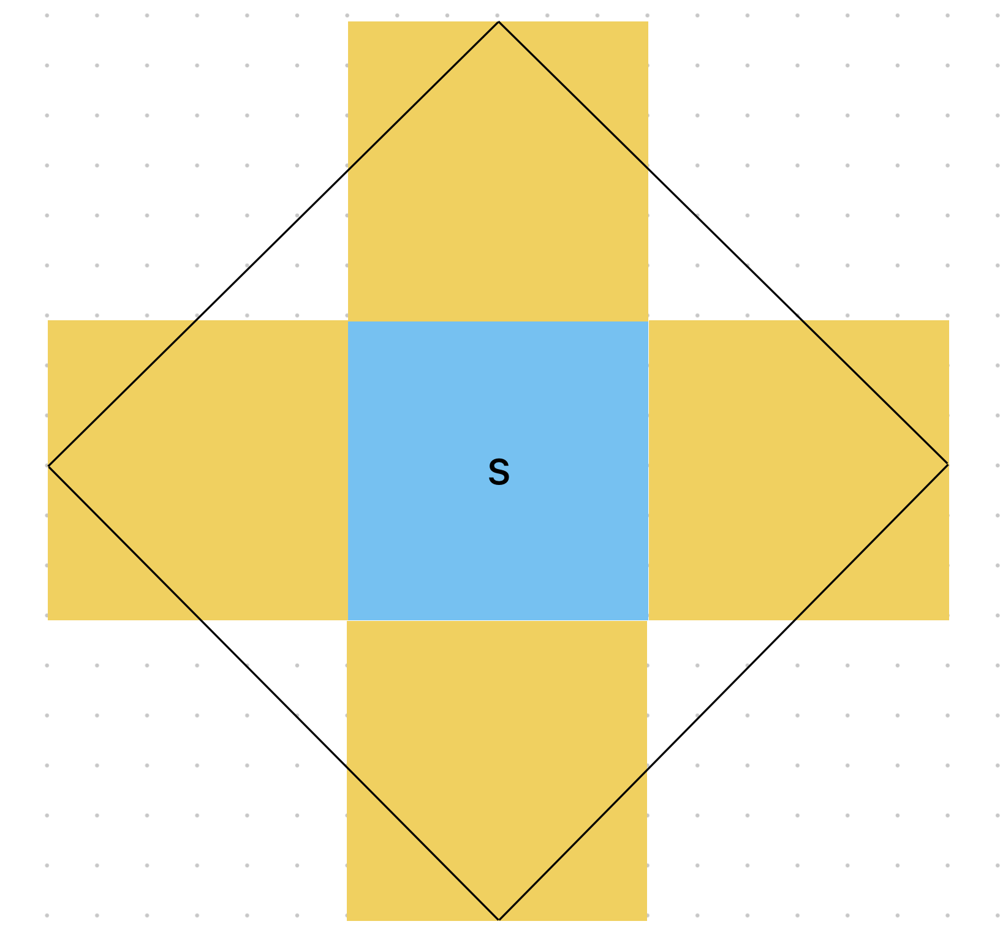

## Part 1

We start in the land of the familiar- parse a grid and generate new states based on old ones. Existing graph utility functions make short work of this (so [check](https://github.com/xavdid/advent-of-code/blob/2ff229ff157289dd92fa4dd161b07a41cb1f0a77/solutions/utils/graphs.py#L65) those [out](https://github.com/xavdid/advent-of-code/blob/2ff229ff157289dd92fa4dd161b07a41cb1f0a77/solutions/utils/graphs.py#L12) if you haven't). We'll be doing a sparse grid which only tracks the points we can step to:

```py
from ...utils.graphs import parse_grid

class Solution(StrSplitSolution):
    def part_1(self) -> int:
        grid = parse_grid(self.input, ignore_chars="#")
        plot_locations = set(grid)

        possible_locations = { next(k for k, v in grid.items() if v == "S") }
```

Next, for each possible location, we move to any adjacent spot in the grid. So we'll be iterating over `possible_locations` to produce next steps. Our iterable of iterables is a good opportunity to break out `itertools.chain.from_iterable`. It'll flatten that nested iterable into a single one:

```py
from itertools import chain
...

class Solution(StrSplitSolution):
    def part_1(self) -> int:
        ...

        for _ in range(64):
            possible_locations = (
                set(
                    chain.from_iterable(
                        neighbors(l, num_directions=4) for l in possible_locations
                    )
                )
                & plot_locations
            )

        return len(possible_locations)
```

The `& plot_locations` is important so that we only consider locations that are possible to move to. We could also filter when calling `neighbors`, but too-deeply nested a comprehension for my tastes.

Onward!

## Part 2

This is a puzzle style that I don't particularly care for. Solutions rely on a feature of the puzzle input that is _not present in the examples_. Eventually figuring that out frustrated me enough that I was ready to be done with the puzzle and took to Reddit for direction. The explanation that clicked best was [this one](https://old.reddit.com/r/adventofcode/comments/18nol3m/2023_day_21_a_geometric_solutionexplanation_for/), by `/u/villi_` (which in turn links to [this github wiki](https://github.com/villuna/aoc23/wiki/A-Geometric-solution-to-advent-of-code-2023,-day-21)). I'll summarize and adapt their solution below.

---

I found this problem much easier to visualize if I shrank it way down, so let's start with that. We'll make a new sample input that has all the important properties of the bigger one.

First off, the grid is a perfect square. Its side length is odd and you start in the exact center. The starting row and column are totally unobstructed. Here a custom example we'll test against:

```
.........
#..#..#.#
#.....#..
..#...##.
....S....
......##.
#.##.###.
..#..#...
.......#.
```

My 9x9 version is missing the big empty diamond in the real input, but that doesn't matter.

Part 1 asks us to count the squares we can reach in `floor(grid_height / 2)` steps. For my little input, that's 4 steps. In the real input, it's 65 steps to reach the edge of the 131x131 grid.

Here's that example grid again, but showing how many steps it takes to reach each everything we can land on in 4 moves:

```
....4....
#..#34#.#
#.4323#..
.4#212##.
432101234
.43212##.
#.##2###.
..#43#...
....4..#.
```

Note how the even numbers only ever touch odd numbers (and vise-versa). Much like a [chess board](https://en.m.wikipedia.org/wiki/File:Chess_Board.svg), there are 2 "colors" of square: those you can reach after an odd number of steps and those you can reach after an even number. This is also known as "parity".

To get the actual answer for part 1 we count which squares we could be on after 4 steps. 4 is an **even** number and doubling back is allowed, so we could be on any evenly-labeled square. By counting the `0`, `2`s, and `4`s above, we get `17`, my example's part 1 answer. Of course, we already did part 1, that's not the interesting part. Let's look at the repeating tiles.

Say we were asked to count the squares we could reach after 13 steps: the distance from part 1 (`S` to the edge, 4 steps), plus the full width of the grid (9).

If we're exploring the (repeated) grid immediately to the right of the starting square, it would look like this (using `A`-`D` in place of `10`-`13`):

```
BABCD....
#9A#CD#.#
#89ABC#..
67#9AB##.
56789ABCD
6789AB##.
#8##B###.
A9#DC#...
BABCD..#.
```

A few things jump out:

1. The tiles that were odd numbers in the first grid have become even in the second (we stepped from `4` on the right edge to `5` on the left edge)
2. The far side of the map (the right half) has the _exact_ same pattern of unreachable tiles as the first map

If we repeat this process with the tiles to the left, above, and below the start tile, we could calculate part 2's answer (if it only asked for 13 steps). Broadly, that would be all the squares in this diamond:



The blue square is our starting tile; its center and edges in each direction can all be reached after an even number of steps. The yellow squares are the inverse (point 1 above): the center of their edges (and middle) are reachable only after an odd number of steps. We'll refer to these as "even" and "odd" tiles respectively.

The diamond shows the edge of what we can reach on that square. Because 13 is exactly `floor(grid_length * 1.5)`, by the time we reach the center of a yellow square we'll only have enough remaining steps to reach an edge (just like part 1).

To complicate things, our diamond _includes_ some not-shown neighboring corners and excludes corners of the farthest tiles tiles (shown in blue and black respectively):


As luck would have it, we know the exact size of those diamonds because they line up with our starting tile (observation 2)! And given that everything is symmetrical, we'll be able to treat the corner squares as a single unit; the second diagram shows that we only deal with corners in multiple of four. Convenient!

Back to the puzzle. The interior of the diamond now includes:

1. the entire "even" starting tile
2. 4 "even" corners
3. most of 4 "odd" tiles, except
4. 8 "odd" corners

Part 2 asks for the number of reachable squares after an odd number of steps (`13` in my example or `26501365` for real) so we only care about squares we can ultimately reach after an odd number of steps.

In the original tile, this is simple: calculate the shortest distance to every single square and count the odd ones. But, we also know that parity inverts after crossing a tile boundary. So for the yellow tiles in the diagram, we need to count the squares we can reach after an _even_ number of steps. There are 4 such yellow tiles.

Now for the corners. There are exactly 4 blue (even-parity) corners to _add_ to our count and exactly 8 yellow (odd-parity) corners to subtract. They're easy to count on our starting tile, since they're any square that takes `> 4` steps reach.

Put all that info together and we've got ourselves a little formula:

```py
1 * num_odd_parity_squares
+ 4 * num_even_parity_squares
+ 1 * num_even_parity_corner_squares
- 2 * num_odd_parity_corner_squares
```

Now, here's the awkward part. I had a lot of trouble building a small example that actually worked using this method. I know it works on my big actual input, but my small examples were consistently off by a few. I'm going to chalk that up to this puzzle being extra finnicky and carry on generalizing this solution to the actual puzzle (since that _does_ work). But it's just one more reason that this puzzle didn't do it for me.

Anyway.

The last hurdle is to replace the multipliers above with their actual values. In my diagrams above, we only crossed one tile boundary (from the start to 1 in each direction). In the actual part 2, we must travel much farther. Though the puzzle prompt of `26501365` seems random, it's far from it. It's exactly the number of steps it would take to exit our starting tile (65 steps) and then travel `202,300` repeated tiles of width 131 (the width of the real input). Given that, how many even and odd tiles will we need to count?

As luck would have it, the number of yellow and blue squares grows quite predictable for higher values of `n` (the number of tile boundaries we cross):


| `n`                | yellow | blue |
| ------------------ | ------ | ---- |
| 0                  | 0      | 1    |
| 1                  | 4      | 1    |
| 2                  | 4      | 9    |
| 3                  | 16     | 9    |
| 4 _(not pictured)_ | 16     | 25   |

For even values of `n` there are n<sup>2</sup> yellow squares and (n+1)<sup>2</sup> blue squares. Because we're going an odd number of steps (`26501365`), we'll count the odd-parity squares on the blue tiles and even-parity squares on the yellow tiles (the **opposite** of the sample above). Interestingly, we'll still add `n` even-parity corners and `n+1` odd ones because they continue to cancel each other out as the shape grows.

With that, I think we're finally ready for some code! After all that figuring, the resulting code is actually a little underwhelming. We can throw out all of my original part 1 code and start with a fairly standard [BFS](https://en.wikipedia.org/wiki/Breadth-first_search):

```py
from collections import deque

from ...utils.graphs import GridPoint, neighbors, parse_grid

class Solution(StrSplitSolution):
    def solve(self) -> tuple[int, int]:
        grid_size = len(self.input)
        grid = parse_grid(self.input, ignore_chars="#")
        plot_locations = set(grid)

        visited: dict[GridPoint, int] = {}
        queue: deque[tuple[int, GridPoint]] = deque(
            [(0, next(k for k, v in grid.items() if v == "S"))]
        )

        while queue:
            distance, point = queue.popleft()

            if point in visited:
                continue

            visited[point] = distance

            for n in neighbors(point, num_directions=4):
                if n in visited or n not in plot_locations:
                    continue

                queue.append((distance + 1, n))
```

Now `visited` is the shortest distance to every square in the input (no repeating; we don't need it!).

Then, part 1. We want the number of squares with even parity that can be reached before hitting the edge (64 steps):

```py
from typing import Callable
...

class Solution(StrSplitSolution):
    def solve(self) -> tuple[int, int]:
        ...

        def num_points_where(f: Callable[[int], bool]) -> int:
            return sum(f(v) for v in visited.values())

        distance_to_edge = grid_size // 2
        assert distance_to_edge == 65 # checking assumptions is good!
        part_1 = num_points_where(lambda v: v < distance_to_edge and v % 2 == 0)
```

For cleanliness, I included a little helper to count `visited` values that match a filter function (once again taking advantage of the fact that `bool`s can be added together).

Next, part 2. We need the number of even & odd tiles and the number of squares in the even and odd corners:

```py
...

class Solution(StrSplitSolution):
    def solve(self) -> tuple[int, int]:
        ...

        # hardcoding for the puzzle input
        n = (26501365 - distance_to_edge) // grid_size
        assert n == 202300, f"n calc wrong, got {n}"
        num_odd_tiles = (n + 1) ** 2
        num_even_tiles = n**2

        odd_corners = num_points_where(lambda v: v > distance_to_edge and v % 2 == 1)
        even_corners = num_points_where(lambda v: v > distance_to_edge and v % 2 == 0)
```

All that remains is to use our equation from above:

```py
...

class Solution(StrSplitSolution):
    def solve(self) -> tuple[int, int]:
        ...

        part_2 = (
            num_odd_tiles * num_points_where(lambda v: v % 2 == 1)
            + num_even_tiles * num_points_where(lambda v: v % 2 == 0)
            - ((n + 1) * odd_corners)
            + (n * even_corners)
        )

        return part_1, part_2
```

It was an absolute slog, but we got there! My thanks again to Redditor `/u/villi_` for their [detailed walkthrough](https://github.com/villuna/aoc23/wiki/A-Geometric-solution-to-advent-of-code-2023,-day-21).
