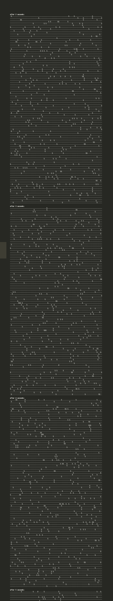
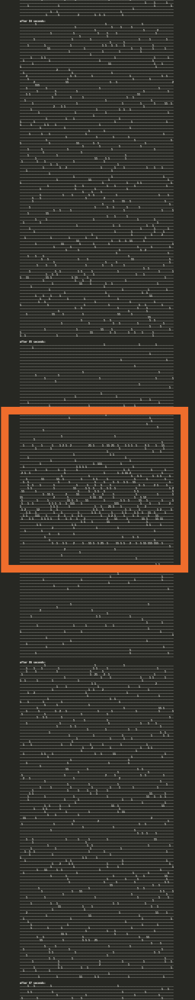
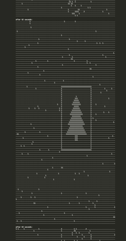

## Part 1

Let's move some robots! We'll start with the quick-and-dirty approach I actually solved with, then we'll do some refining as we go.

First up is an unusual feature: the grid size is different between the test and real inputs! Luckily, my `Solution` class has the mode available as a property:

```py
class Solution(StrSplitSolution):
    def part_1(self) -> int:
        if self.use_test_data:
            num_cols = 11
            num_rows = 7
        else:
            num_cols = 101
            num_rows = 103
```

That out of the way, we can parse some robots out of our input. Much like previous days, we can use regex to extract every number out of each line, since we know exactly where everything will be:

```py
import re

class Solution(StrSplitSolution):
    def part_1(self) -> int:
        ...

        for line in self.input:
            col, row, v_col, v_row = [int(s) for s in (findall(r"-?\d+", line)]
```

> NOTE: despite the prompt using `x` and `y` for the coordinates, I stuck with my `row` and `col` coordinates (as described [on day 4](/writeups/2024/day/4/)), since I find that easiest to reason about. All that took was ordering the variable names a little differently.

In contrast to previous days, we have to ensure to include `-?` in our regex to account for negative numbers. That was a fun bug.

Anyway, now that we have the robots, we need to move them. The most basic approach is to add the robot's velocity to its position, then modulo the size of the grid in each direction. Do that 100 times and we know where the robot lands.

Luckily, we can shortcut our repeated addition with a bit of multiplication! We can do all our steps at once and modulo a single time rather than wrapping after every step. That makes calculating each robot's final position simple:

```py ins={7,12,13,15}
...

class Solution(StrSplitSolution):
    def part_1(self) -> int:
        ...

        robots: list[GridPoint] = []

        for line in self.input:
            col, row, v_col, v_row = parse_ints(findall(r"-?\d+", line))

            updated_row = (row + v_row * 100) % num_rows
            updated_col = (col + v_col * 100) % num_cols

            robots.append((updated_row, updated_col))
```

Some quick spot checks against the test input confirm that our robots have landed in the expected locations!

Next, we have to divide the grid into quadrants. Because we know that our grid boundaries are odd, each dimension will have an exact middle equal to half of the size (rounded down). A robot in a quadrant will have coordinates that are strictly greater or less than each of those lines.

To count each quadrant, we nee every combination of `<` and `>` for both rows an columns; 4 quadrants in all. We reach once again for `itertools.product`:

```py
from itertools import product
from operator import gt, lt
...

class Solution(StrSplitSolution):
    def part_1(self) -> int:
        ...


        row_boundary = num_rows // 2
        col_boundary = num_cols // 2

        total = 1
        for row_op, col_op in product([lt, gt], repeat=2):
            total *= len(
                [
                    1
                    for r in robots
                    if row_op(r.row, row_boundary) and col_op(r.col, col_boundary)
                ]
            )

        return total
```

## Part 2

Now we have to... find a Christmas tree? This is a new one. I'll assume that we'll know it when we see it. In contrast to part 1, we'll need to be stepping our robots manually and Might as well do some cleanup before we get too deep into it.

## Part 1 Cleanup

Because each robot is self-contained, it's a good candidate for [encapsulation](<https://en.wikipedia.org/wiki/Encapsulation_(computer_programming)>). For part 1, our robot needs to be able to take a step and report its quadrant. That's easy to wrap in a class:

```py
from dataclasses import dataclass
...

@dataclass
class Robot:
    num_cols: int
    num_rows: int
    col: int
    row: int
    v_col: int
    v_row: int

    @staticmethod
    def from_line(line: str, num_cols: int, num_rows: int) -> "Robot":
        # unknown-length items go last to type checker doesn't complain
        return Robot(num_cols, num_rows, *parse_ints(findall(r"-?\d+", line)))

    def step(self, distance=1):
        self.row = (self.row + self.v_row * distance) % self.num_rows
        self.col = (self.col + self.v_col * distance) % self.num_cols

    @property
    def quadrant(self) -> int:
        row_boundary = self.num_rows // 2
        col_boundary = self.num_cols // 2

        for quadrant, (row_op, col_op) in enumerate(product([lt, gt], repeat=2)):
            if row_op(self.row, row_boundary) and col_op(self.col, col_boundary):
                return quadrant

        return -1
```

The implementations should look familiar based on our part 1 code. I went with a `staticmethod` for an alternative constructor to encapsulate turning a line into a `Robot`- the caller doesn't need to know how that works. This is a common pattern in Rust code and, if you're [writing Python like it's Rust](https://kobzol.github.io/rust/python/2023/05/20/writing-python-like-its-rust.html#using-construction-functions), makes for nice constructors for dataclasses with lots of fields.

Back in our part 1 code, we can vastly simplify our approach:

```py ins={1,2,14-20}
from collections import defaultdict
from math import prod
...

class Solution(StrSplitSolution):
    def part_1(self) -> int:
        if self.use_test_data:
            num_cols = 11
            num_rows = 7
        else:
            num_cols = 101
            num_rows = 103

        quadrants = defaultdict(int)
        for line in self.input:
            r = Robot.from_line(line, num_cols, num_rows)
            r.step(100)
            quadrants[r.quadrant] += 1

        return prod(quadrants[i] for i in range(4))
```

That's the whole thing! We can initialize, move, and locate our robots in a single pass now. We store how many robots report for each quadrant, then multiply them up at the end. I was especially proud of storing the hidden robots in `-1`. Because `range` starts at `0`, we can skip them for free. Otherwise, we'd have to only store robots who reported a value or something, which would require extra conditionals and checks. This felt much more elegant. We also got to use `math.prod`, which is the multiplication equivalent of `sum`!

## Part 2 For Real

Now it's time to look for patterns in the noise! I wasn't sure where to start, so I started simple: take a step and print the grid:

```py
from collections import Counter
...

@dataclass
class Robot:
    ...

    @property
    def position(self) -> tuple[int, int]:
        return self.row, self.col

class Solution(StrSplitSolution):
    def part_2(self) -> int:
        ... # declare boundaries
        robots = [Robot.from_line(line, num_cols, num_rows) for line in self.input]

        for i in range(100):
            for r in robots:
                r.step()

            locations = [r.position for r in robots]
            grid = Counter(locations)

            print(f"\nafter {i+1} seconds:")
            for r in range(num_rows):
                print("".join(str(grid.get((r, c), ".")) for c in range(num_cols)))
```

This worked great for printing the grid! `collections.Counter` makes counting the robots at each location simple. But, the printed pages are so long (103 rows tall) that it was hard to get the perspective I though I'd need. So I tweaked my code to dump to a file instead:

```py rem={15,17-18,24} ins={8,16,19-22,25}
from pathlib import Path
...

class Solution(StrSplitSolution):
    def part_2(self) -> int:
        ...

        images: list[str] = []

        for i in range(100):
            ...

            grid = Counter(locations)

            print(f"\nafter {i+1} seconds:")
            images.append(f"\nafter {i+1} seconds:")
            for r in range(num_rows):
                print("".join(str(grid.get((r, c), ".")) for c in range(num_cols)))
            images.extend(
                "".join(str(grid.get((r, c), ".")) for c in range(num_cols))
                for r in range(num_rows)
            )

        print("\n".join(images))
        Path(__file__, "..", "output.txt").resolve().write_text("\n".join(images))
```

Then, I used [VSCode's minimap](https://code.visualstudio.com/docs/getstarted/userinterface#_minimap) (which I usually have turned off, but was very useful here) to get a super zoomed out view of the pages:



Unfortunately, no Christmas trees; just a lot of random noise. I upped the number of pages to check from `100` to `1_000` and scrolled through them quickly but still nothing.

But, I did notice that about halfway through my first hundred pages, there was an image that looked like it was _trying_ to be something.

SEVERENCE GIF NUMBERS

It's not a tree, but you can clearly see there's more _something_ on the highlighted image than in the others:



Let's go down this rabbit hole! We know that the vertical position of every robot will repeat every `103` seconds (since that's how many rows our "screen" has). Instead of printing every page, let's have our program print each page that shows that horizontal band (starting with the first):

```py rem={11,14,17} ins={7-9,12,15,18}
...

class Solution(StrSplitSolution):
    def part_2(self) -> int:
        ...

        START = 63 # for my input; yours is probably slightly different
        for r in robots:
            r.step(START)

        for i in range(100):
        for i in range(1, 100): # our first loop is now the second step
            for r in robots:
                r.step()
                r.step(num_rows)

            images.append(f"\nafter {i+1} seconds:")
            images.append(f"\nafter {START + num_rows * i} seconds:")

        ...
```

Now we're cooking! The only big change is that we're stepping in multiples of the screen height and adjusting our starting position (and number printing) accordingly. Despite not knowing what to look for, after scrolling through these 100 images, something definitely jumps out:

<details>
<summary>The revealed puzzle image (click to show)</summary>



</details>

The page number directly above this image is our answer!

## Part 2 (Programmatically)

While we've gotten our gold star, my goal for AoC is typically for the program to spit out the exact value I'm supposed to plug into the site. Our code gave us the answer, but we still had to go hunting for it, so let's do one final pass.

Now that we know what we're looking for, we can write a program to extract it. Looking at tree in all its glory, one interesting thing is that it's comprised _only_ of `1`s. Most of the other pages have at least a few `2`s and maybe even some `3`s. I have a feeling that Eric included this unique property of the image page to help us find it. Let's try out returning the first page with totally unique positions:

```py ins={7,10,11}
...

class Solution(StrSplitSolution):
    def part_2(self) -> int:
        ...

        num_robots = len(robots)

        for i in range(1, 100):
            if num_robots == len(set(locations)):
                return START + num_rows * i
```

And there it is! Our puzzle answer once again.

Now the only manual part is telling part 2 where to `START`. Figuring we did part 1 for _some_ reason, I printed out the safety score for each of the first hundred pages. And wouldn't you know it, my vertical and horizontal bar pages were the safest! Assuming the vertical one always comes first (which I didn't confirm with any other inputs), then we can do the entire puzzle, start to finish, in the (probably) general case with the following:

```py rem={19,26,30} ins={7-17,20,27,31}
...

class Solution(StrSplitSolution):
    def part_2(self) -> int:
        ...

        # find the "safest" page
        robots = [Robot.from_line(line, num_cols, num_rows) for line in self.input]
        pages: list[tuple[int, int]] = []
        for page_num in range(1, 100): # our first saved page is page 1
            quadrants = defaultdict(int)
            for r in robots:
                r.step()
                quadrants[r.quadrant] += 1

            score = prod(quadrants[q] for q in range(4))
            pages.append((score, page_num))

        START = 63 # for my input; yours is probably slightly different
        _, START = sorted(pages)[0]

        ... # re-initialize robots here

        for i in range(1, 100):
            for r in robots:
                r.step(num_rows)
                r.step(num_cols)
            ...

            return START + num_rows * i
            return START + num_cols * i
```

It's basically our part 1 code over-and-over. We could have reused some code here, but despite their similarity, part 2 and this block have pretty different goals. So, I'm happy to leave them as they are. We also started stepping by `num_cols` instead of `num_rows`, since the page with the "vertical" band (not shown, but looks similar) is the "safest". Overall, I'm happy with how this turned out!

Lastly, there was some chatter on the subreddit about frustration around today's puzzle. The instructions felt sparse and with less direction than we normally get. Ultimately, I liked it. We think of AoC as "write code to solve a puzzle", but really it's "solve a puzzle; writing code will probably help". Today was definitely the latter case. I might have liked a little more direction, but we definitely knew it when we saw it, so I'm not too bothered.
